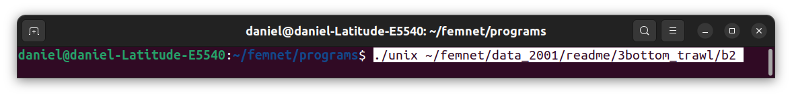
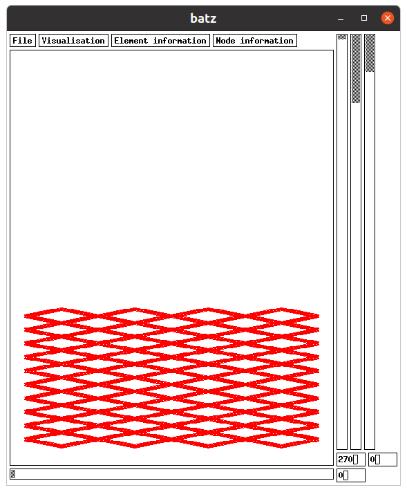
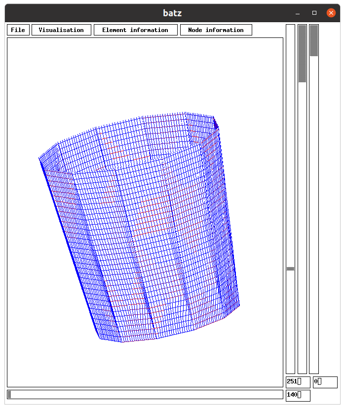
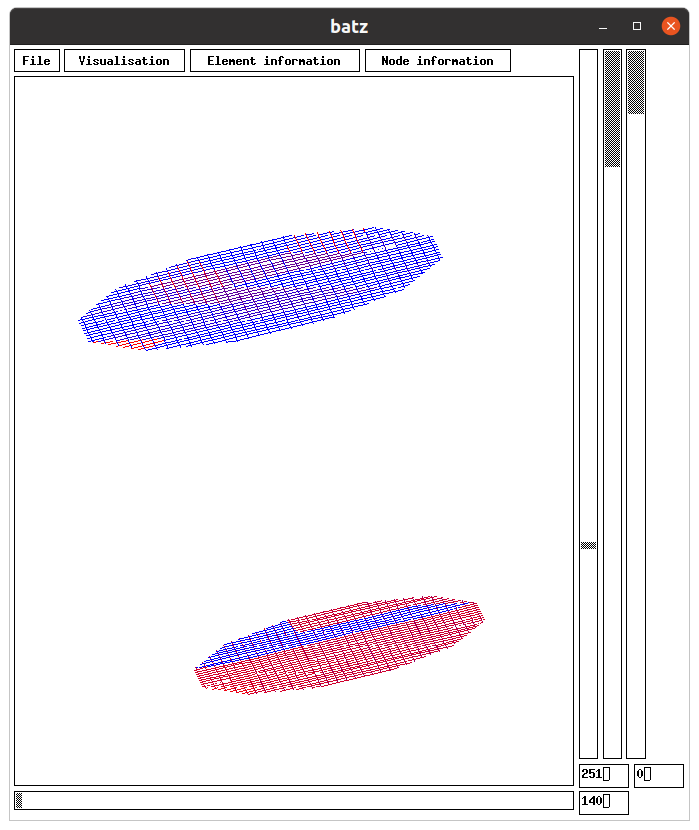
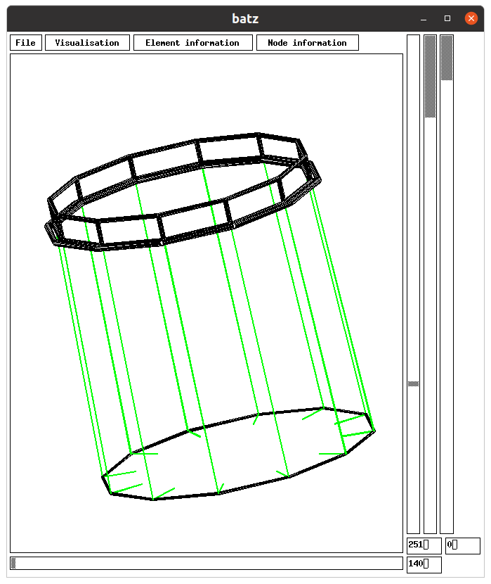

# FEMNET

FEMNET is a numerical modelling dedicated to mechanical assessment of
flexible structures such as fishing gear and fish cage. This numerical
modelling is based on the finite element method with a specific emphasis
on netting structures. Netting is a main component of fish cage and
fishing gear. This numerical modelling using the finite element method
also takes into account cables, bars, floats and netting. FEMNET has
been used in several scientific papers: [@{priour 1999}], [@priour2001],
[@priour2003] and book: [@Priour2013].

FEMNET runs on linux.

## Download it:

\- Download the source code

Previous versions are on https://gitlab.ifremer.fr/dp00644/femnet, 
and http//http://femnetting2.free.fr/

In the following these files are placed in your computer in \~/femnet.

\- Libsx is the graphics library. FEMNET (batz and phobos programs) requires the file libsx.a. 2
possibilities to get it: a) use \~/femnet/libsx/src/libsx.a hoping that
it is usable on your computer; b) find libsx on internet, compile it to
get a libsx.a adapted to your computer.

\- Edit makefile of \~/femnet/phobos_2005, and \~/femnet/batz and modify 
the path of libsx.a in order to indicate the path of your libsx.a.

\- Do make in \~/femnet/lib_dp, in \~/femnet/unix_2004, in
\~/femnet/dyna2, in \~/femnet/phobos_2005, in \~/femnet/batz and in
\~/femnet/gengis.

\- Place \~/femnet/unix_2004/unix, \~/femnet/dyna2/dyna,
\~/femnet/phobos_2005/phobos, \~/femnet/batz/batz and
\~/femnet/gengis/gengis in \~/femnet/programs.

## Main characteristics to know before to use it

To use FEMNET a main file is required: \*.don. \*.don file has to be
write by the user. This file describe the structure and its environment.
FEMNET is dedicated to assess the structure equilibrium in this
environment.

5 tools are also required. They are in \~/femnet/programs:

phobos to transform \*.don file in \*.mdg file which is compatible with
calculation of equilibrium by Finite Element Method.

unix which calculated the equilibrium in static conditions from \*.don
file and \*.mdg file and records the equilibrium in \*.sta file.

dyna which calculate the equilibrium in dynamic conditions from \*.don
file, \*.mdg file and \*.sta file and records the dynamic equilibrium in
\*.dyn file.

batz which display the equilibrium of the structure. It uses mainly
\*.sta file and \*.dyn file if any.

gengis which is an help for the construction of \*.don file. It records 
the result in a specific file and in \*.don file.

# From the design to the equilibrated shape

A design of a structure, such as on figure 1, determines the netting panels, the
cables, the rigging. This design has to be integrated in FEMNET. This
integration is done trough the \*.don file and can be read by ./phobos
tool (figure 2). ./phobos integrates the design in order to create a \*.mdg file
compatible with Finite Element Method calculation tool ./unix. At this
step the shape of the structure is not equilibrated (figure 3). An equilibrated
shape could be assessed with ./unix tool. ./unix creates an \*.sta file.
The equilibrated shape is be displayed with ./batz tool (figure 4).

*Figure 1*: Trawl design: netting panels and
cables.

*Figure 2*: Trawl design integrated in
./phobos.

*Figure 3*: Initial shape (not equilibrated) of the
trawl.
*Figure 4*: Final shape (equilibrated) of the
trawl.

# \*.don file

\*.don file has two parts:

\- the first part follows a strict template.

\- the second part is a succession of commands which don't need to
follow a specific order.

These two parts are described in the following.

\*.don file requires colons (:). Colons (:) are used as separators, for
example between a comment and a parameter value. It is recommended, if
you modify a \*.don file, not to delete colons and not to add colons.
For example in the first line of the following \*.don file (**design in
the plane normal to axis: 2**), **design in the plane normal to axis** is
the comment, **2** is the value of the parameter and between these two
parts there is a colon (**:**).

In the following, s1.don file (in
\~/femnet/data_2001/readme/1pelagic_trawl) is displayed in **bold**, a
tentative of explanation is given with figures. This file
describes a pelagic trawl. In this file the boat is fixed and a current
represents the towing speed. The file begins with the first part which
follows a strict template:

## \-The first part:

In this first part, the order of the commands must be respected.

**design in the plane normal to axis: 2**

The design of the structure is done in the plane normal to axis **2**
(Y) that means in the plane ZX.

This is used by phobos. The gives the view of phobos of this file. That
shows panels of netting in blue, cables or bars in red. The design is in
the plane ZX. To get the view of do cd \~/femnet/programs, ./phobos,
File, load_don_file, choose s1.don, Visualisation, contour_diamond,
Visualisation, contour_cable_bar, Visualisation, axes. If, in place of
2, 1 is used, the design is in the plane YZ. If 3 is used the design is
in the plane XY.

**panels number: 25**

There are **25** panels of netting of diamond meshes, which can be seen
in blue on 
*Figure 5*: Design of a pelagic trawl

**Panel: 1**

The value **1** is not used. In fact the panel 1 is the first of this
list of panels, panel 2 is the second and so on.

**number of nodes around: 10**

The panel 1 is a polygon made of **10** nodes around.

**nodes of the contour no x y z U V type and following type:**

**1 37.000000 0.000000 20.000000 0.000000 27.500000 2 2**

This list of number are described in the following: The corner 1 is the
first of this list of corners, the corner 2 the second and so on. The
corner **1** has a position X,Y and Z of **37**m, **0**m and **20**m.
The user defines an origin for counting the number of meshes for each
corner. The origin is constant for all the corners of a panel. The
corner 1 is at **0** mesh along U meshes and is at **27.5** mesh along V
meshes. These number of meshes are calculated from the design.
The displays the number of meshes for the corners of panel 1. The type
of corner 1 is **2** and the type of nodes, if any, between corner 1 and
corner 2 is **2**. This point will be discussed later.

**2 46.000000 0.000000 24.000000 7.000000 37.500000 2 2**

**3 71.000000 0.000000 22.000000 25.000000 32.500000 2 2**

**4 111.000000 0.000000 12.000000 55.000000 17.500000 2 2**

**5 111.000000 0.000000 -12.000000 55.000000 -17.500000 2 2**

**6 71.000000 0.000000 -22.000000 25.000000 -32.500000 2 2**

**7 46.000000 0.000000 -24.000000 7.000000 -37.500000 2 2**

**8 37.000000 0.000000 -20.000000 0.000000 -27.500000 2 2**

**9 71.000000 0.000000 -3.000000 25.000000 -2.500000 2 2**

**10 71.000000 0.000000 3.000000 25.000000 2.500000 2 2**

*Figure 6*: Design of panel 1. Twines diameter, mesh
side are displayed, as well as the number of meshes
and the cutting. The origin of mesh counting is the
knot under the red dot. Only one twine on 10 is
drawn.

*Figure 7*: Mesh coordinates of the corners of the panel 1 of netting,
displayed with phobos using \~/femnet/data_2001/readme/1pelagic_trawl/s1. Displayed with phobos tool.

**Traction stiffness (N): 25000.000000**

The traction stiffness, more exactly the force required to double the
length of the twine, is **25000**N. This value is E.A. E is the Young
modulus of the material and A (N/m²) is the material section of the
twine (m²).

**Compression stiffness (N): 1.000000**

*The compression stiffness is **1**N. That means that there is more or
less no force required to compressed the twine.*

**Mesh opening stiffness (N.m/rad): 0.000000**

The mesh opening stiffness is the couple required to open the mesh of 1
Rad. Generally speaking, use **0**N.m/Rad. For stiff netting see
p[64](#anchor-9).

**Unstretched length (m): 0.400000**

*The unstretched length is the length of the mesh side from a middle of
a knot to the middle of a neighbouring knot.*

**Volumic mass (kg/m3): 1025.000000**

The volumic mass of the netting (material and sea water inside the
hydrodynamic diameter, see p[127](#anchor-10) a method of assessment).
Note that the default volumic mass of sea water used here is 1025kg/m³.

**Hydrodynamic diameter (m): 0.002800**

The diameter of the twine. This diameter is used for the calculation of
the drag, the mass and the floatability.

**Knot size (m): 0.005600**

In case of the meshes are closed, the closing could be limited by the
size of the knot. A default value is twice the twine diameter. 0.0 is
also used.

**Normal Cd: 1.200000**

Normal Cd for the calculation of the drag. 1.2 is an usual value.

**Tangential Cd: 0.080000**

Tangential coefficient for the calculation of the drag. 0.08 is an usual
value.

**Meshing step (m): 27.000000**

The distance between the numerical nodes created by phobos. Here the
value is quite large, for finer calculations, as it can be seen in
following files, this meshing step will decrease.

**Type of internal nodes: 2**

Type of the numeric nodes created by phobos. This point will be
discussed later (p[15](#anchor-7)).

**Meshing type: 2**

When the meshing type is 1 there is no constraint on the creation of the
nodes by phobos. If the meshing type is **2**, phobos tries to create
the numeric node on a knot. It is preferable to use meshing type 2.

**Panel: 2**

Continue the same for all the panels. Here the panels 3 to 24 have been
hidden.

**number of nodes around: 7**

**nodes of the contour no x y z U V type and following type:**
**1 36.000000 0.000000 32.000000 0.000000 -32.500000 2 2**
**2 71.000000 0.000000 53.000000 25.000000 -7.500000 2 2**
**3 71.000000 0.000000 60.000000 25.000000 0.000000 3 3**
**4 111.000000 0.000000 60.000000 55.000000 0.000000 3 2**
**5 111.000000 0.000000 42.000000 55.000000 -24.500000 2 2**
**6 71.000000 0.000000 30.000000 25.000000 -42.500000 2 2**
**7 46.000000 0.000000 27.000000 7.000000 -39.500000 2 2**

**Traction stiffness (N): 25000.000000**
**Compression stiffness (N): 1.000000**
**Mesh opening stiffness (N.m/rad): 0.000000**
**Unstretched length (m): 0.400000**
**Volumic mass (kg/m3): 1025.000000**
**Hydrodynamic diameter (m): 0.002800**
**Knot size (m): 0.005600**
**Normal Cd: 1.200000**
**Tangential Cd: 0.080000**
**Meshing step (m): 27.000000**
**Type of internal nodes: 2**
**Meshing type: 2**
.
.
.
**Panel: 25**

**number of nodes around: 4**
**nodes of the contour no x y z U V type and following type:**
**1 186.00000 0.000000 -60.000000 0.000000 0.000000 3 3**
**2 205.00000 0.000000 -60.000000 450.00000 0.000000 3 2**
**3 205.00000 0.000000 -56.000000 450.00000 62.500000 2 2**
**4 186.00000 0.000000 -56.000000 0.000000 62.500000 2 2**

**Traction stiffness (N): 25000.000000**
**Compression stiffness (N): 1.000000**
**Mesh opening stiffness (N.m/rad): 0.000000**
**Unstretched length (m): 0.025000**
**Volumic mass (kg/m3): 1025.000000**
**Hydrodynamic diameter (m): 0.002800**
**Knot size (m): 0.005600**
**Normal Cd: 1.200000**
**Tangential Cd: 0.080000**
**Meshing step (m): 27.000000**
**Type of internal nodes: 2**
**Meshing type: 2**

**hexagonal panels number: 0**

**mber of panels of hexagonal meshes. Use 0, as the hexagonal meshes are
not explained in this document.

**Cables number: 26**

There are **26** cables or bars.

**Cable: 1**

The value **1** is not used. In fact the cable (or bar) 1 is the first
of this list of cables, cable 2 is the second and so on.

**Extremities no x y z type:**
**1 0.000000 0.000000 0.000000 1**
**2 2.000000 0.000000 0.000000 4**

There are 2 extremities (corners) for each cable or bar. The extremity 1
is the first, extremity 2 is the second. The coordinates X,Y,Z of
extremity **1** are **0**m, **0**m, **0**m and **2**m, **0**m, **0**m
for extremity **2**. The type of node of extremity 1 is **1** and **4**
for extremity 2 (p[15](#anchor-7)).

**Traction stiffness (N): 62000000.000000**

This characteristics are the same as the one uses for twines previously
described.

**Compression stiffness (N): 1.000000**
**Unstretched length (m): 200.000000**
**Volumic mass (kg/m3): 4800.000000**
**Hydrodynamic diameter (m): 0.026000**
**Normal Cd: 1.800000**
**Tangential Cd: 0.080000**
**Bars number: 9**

This cable will be discretized by **9** bars. For finer calculations in
following files this number will decrease.

**Type of internal nodes: 2**

The nodes created by the 9 bars are of type **2** (p[15](#anchor-7)).

**Cable: 2**

*Continue the same for all the cables and bars. In this document, only
few cables/bars are shown.*

**Extremities no x y z type:**
**1 3.000000 0.000000 1.000000 4**
**2 8.000000 0.000000 5.000000 2**

**Traction stiffness (N): 200000000.000000**
**Compression stiffness (N): 200000000.000000**
**Unstretched length (m): 3.000000**
**Volumic mass (kg/m3): 1025.000000**
**Hydrodynamic diameter (m): 0.010000**
**Normal Cd: 1.800000**
**Tangential Cd: 0.080000**
**Bars number: 1**
**Type of internal nodes: 2**
.
.
.
**Cable: 18**

**Extremities no x y z type:**
**1 32.000000 0.000000 -16.000000 2**
**2 64.000000 0.000000 -2.000000 2**

**Traction stiffness (N): 20000000.000000**
**Compression stiffness (N): 1.000000**
**Unstretched length (m): 20.000000**
**Volumic mass (kg/m3): 4800.000000**
**Hydrodynamic diameter (m): 0.012500**
**Normal Cd: 1.800000**
**Tangential Cd: 0.080000**
**Bars number: 1**
**Type of internal nodes: 2**

**Sliding cables number: 0**

This number must be always **0**. There is a new method for the sliding
ropes which will be described later.

**Links number: 52**

*The panels and cables/bars have to be linked together. Here there are
**52** links. The shows few links. The four corners (panels corners and
cables extremities) noted 6 on are linked together, that means that they
are represented by only one numeric node in the numerical model. The two
corners noted 52 are linked. Be careful to the following rule: if two
components are linked together by consecutive corners it is equivalent
to a sewing of the two components. For example, on the , the panel side
between links 7 and 14 of panel 1 and the cable 18 with links 7 and 14
are sown. The shows that the nodes which are created on the panel side
and the cable are linked (links 122 to 127). The tool gengis (gengis in
\~/femnet/programs) is specifically designed for creating the a first 
level f \*.don file.*

**nb_pt: 3 el: 3 nd: 1 el: 2 nd: 1 el: 1 nd: 2**

*This link relies **3** corners: extremity (**nd**) **1** of cable
(**el**) **3**, extremity (**nd**) **1** of cable (**el**) **2** and
extremity (**nd**) **2** of cable (**el**) **1**.*

**nb_pt: 3 el: 6 nd: 1 el: 4 nd: 2 el: 3 nd: 2**
.
.
.
**nb_pt: 2 pa: 1 nd: 6 pa: 3 nd: 6**

*Figure 8*: Links between components. The two corners noted 52 are
linked and this link is the 52. View of phobos using
\~/femnet/data_2001/readme/1pelagic_trawl/s1.

**Meshing order:**
**el: 23 el: 24 pa: 24 pa: 25 pa: 22 pa: 23 ***pa: 1*** pa: 2 pa: 3 pa: 4**
**pa: 5 pa: 6 pa: 7 pa: 8 pa: 9 pa: 10 pa: 11 pa: 12 pa: 13 pa: 14**
**pa: 15 pa: 16 pa: 17 pa: 18 pa: 19 pa: 20 pa: 21 el: 1 el: 2 el: 3**
**el: 4 el: 5 el: 6 el: 7 el: 8 el: 9 el: 10 el: 11 el: 12 el: 13**
**el: 14 el: 15 el: 16 el: 17 ***el: 18*** el: 19 el: 20 el: 21 el: 22 el:**
**25 el: 26**

The meshing order defined the order by which each component is
discretized by phobos. This is in relation with the previous point: the
links between components. In the list above the panel 1 (**pa: 1**) is
listed before cable 18 (**el: 18**), that means that the panel 1 is
discretized before cable 18, the numeric nodes inside and around panel 1
are created before those of cable 18. In this example the discretization
step of panel 1 is 3 m, that gives 6 new numeric nodes (links 122, 123,
124, 125, 126, 127 on ) on the panel side as visible on . If cable 18
(el: 18) is before panel 1 (pa: 1) in the meshing order the result could
be different: because the number of bars in cable 18 is 3 (see
\~/femnet/data_2001/readme/1pelagic_trawl/s1.don) that leads to create
on this cable 2 new numeric nodes, and because panel 1 is sown to cable
18, consequently, on the side of panel 1 there are 2 new numeric nodes
(links 58, 59) also, as visible on the .

*If the meshing order does not matter which is quite often the case, the
list **Meshing order: el: 23 .. .. .. .. ****el: 26** could be replaced
by **Meshing order: ****all**, in this case cables are meshed before
diamond netting panels, and cable n before cable n+1 (idem for panels.)
Another possibility is to use **Meshing order: ****b****ll**, in this
case diamond netting panels are meshed before cables, and panel n before
panel n+1 (idem for cables.)*

**Number of types of nodes: 4**

There are 4 types of nodes

**No du type : 1**

The type 1. Be careful this value **1** is not used: The type 1 is the
first of this list, the type 2 is the second and so on.

**Mass X,Y,Z (kg): 0.000000 0.000000 0.000000**

The node mass. The mass along X, Y and Z could be different. Generally
these 3 masses are equal.

**Added mass X,Y,Z (kg): 0.000000 0.000000 0.000000**

The added mass in case of dynamic.

**Length X,Y,Z (m): 0.000000 0.000000 0.000000**

The length of the node along X, Y and Z axis. These lengths could lead
to floatability due to the volume and drag due to sections.

**Drag coefficient X,Y,Z: 1.200000 1.200000 1.200000**

The drag coefficient applied on sections.

**External forces X,Y,Z (N): 0.000000 0.000000 0.000000**

External constant forces along X, Y and Z axis.

**Displacement X,Y,Z: 1 1 1**

if **0** the displacement of the nodes with this type is possible. If
**1** the node is fixed. The displacement is along X, Y and Z.

**Limits X,Y,Z (m): 0.000000 0.000000 0.000000**

In case of bottom sea the limit along Z is minus the depth. The limits
could be also along X and Y axis.

**Limits sense X,Y,Z: 0 0 0**

If limits sense is **0** there is no limit. If limits sense is **1**,
the limit previously defined is a floor. If limits sense is **-1**, the
limit is a ceiling.

**Symmetry X,Y,Z: 0 0 0**

In case of symmetry relatively to the plane Y,Z (Z,X and X,Y) use **1 0
0** (**0 1 0** and **0 0 1**). In case of no symmetry use **0 0 0**.

**No du type : 2**
**Mass X,Y,Z (kg): 0.000000 0.000000 0.000000**
**Added mass X,Y,Z (kg): 0.000000 0.000000 0.000000**
**Length X,Y,Z (m): 0.000000 0.000000 0.000000**
**Drag coefficient X,Y,Z: 1.200000 1.200000 1.200000**
**External forces X,Y,Z (N): 0.000000 0.000000 0.000000**
**Displacement X,Y,Z: 0 0 0**

if **0** the displacement of the nodes with this type is possible. If
**1** the node is fixed. The displacement is along X, Y and Z.

**Limits X,Y,Z (m): 0.000000 0.000000 0.000000**
**Limits sens X,Y,Z: 0 0 0**
**Symmetry X,Y,Z: 0 0 0**

**No du type : 3**
**Mass X,Y,Z (kg): 0.000000 0.000000 0.000000**
**Added mass X,Y,Z (kg): 0.000000 0.000000 0.000000**
**Length X,Y,Z (m): 0.000000 0.000000 0.000000**
**Drag coefficient X,Y,Z: 1.200000 1.200000 1.200000**
**External forces X,Y,Z (N): 0.000000 0.000000 0.000000**
**Displacement X,Y,Z: 0 0 0**
**Limits X,Y,Z (m): 0.000000 0.000000 0.000000**
**Limits sens X,Y,Z: 0 0 0**
**Symmetry X,Y,Z: 0 1 0**

**No du type : 4**

**Mass X,Y,Z (kg): 0.000000 0.000000 0.000000**
**Added mass X,Y,Z (kg): 0.000000 0.000000 0.000000**
**Length X,Y,Z (m): 0.000000 0.000000 0.000000**
**Drag coefficient X,Y,Z: 1.200000 1.200000 1.200000**
**External forces X,Y,Z (N): 5600.000000 13000.000000 -15000.000000**
**Displacement X,Y,Z: 0 0 0**
**Limits X,Y,Z (m): 0.000000 0.000000 0.000000**
**Limits sens X,Y,Z: 0 0 0**
**Symmetry X,Y,Z: 0 0 0**

These 4 types of node show that nodes could be fixed (type 1), free to
move (type 2), free to move and on symmetry plane (type 3) and free to
move with external forces (***5600.000000 13000.000000 -15000.000000**,
*type 4). This last type (type 4) is dedicated to trawl door. To assess
the hydrodynamic forces on trawl doors, use their hydrodynamic
characteristics (drag coefficient, lift coefficient,as it is defined for
example in [@{Les panneaux de chalut}]), their surface and the water
speed. For the vertical force use the weight of the trawl door.

**NUMERIC ENVIRONMENT**
**Divisor (s): 0.000050**

Not used.

**Convergence threshold (N): 0.100000**

The equilibrium is reached when the mean disequilibrium force per node
is smaller than the convergence threshold (N).

**Displacement limit for each iteration (m): 10.000000**

Maximal displacement at each iteration per node (m).

**Maximal number of iterations: 10000**

If the convergence is not reached, the calculation stops when the number
of iterations reaches this value.

**Dynamic: [Time step (s): 0.100000**

In case of dynamic, calculation time step (s).

**Dynamic: Record time step (s): 0.200000**

In case of dynamic, time step for recording the shape of the structure
(s). Record time step is equal or larger than time step.

**Dynamic:Beginning time of record (s): 0.000000**

In case of dynamic, beginning time for recording the shape of the
structure (s).

**Dynamic: End time of record and calculation (s): 0.000000**

In case of dynamic, end time for calculation and recording the shape of
the structure (s).

**METEO/OCEANIC ENVIRONMENT**

**Current direction (deg): 0.000000**

Direction of the current (deg.). When 0, the current is along X axis;
when 90, the current is along Y axis; when 180, the current is opposite
X axis; when 270 the current is opposite Y axis. As said previously, the
boat is, in this model, fixed and the towing speed is represented by a
current.

**Current speed (m/s): 2.058000**

**Current amplitude (m/s).**

**Wave period (s): 10.000000**

Wave period, only in case of dynamic (s). The default model is Airy
intermediate depth. For the other models (Stokes 2d intermediate depth,
Stokes 3d deep waters) see later "input wave_model".

**Wave height (m): 0.000000**

Wave height only in case of dynamic (m). Wave height is the double of
wave amplitude.

**Wave direction relatively X (deg): 0.000000**

Wave direction only in case of dynamic (deg.).

**Depth (m): 2000.000000**

Depth used for wave calculation in case of dynamic (m). This depth is
also used for visualisation with batz. Be careful, this depth is not
used as limit of vertical position of nodes. For such limit see type of
node previously described.

**CATCH DESCRIPTION**

**Volume (m3): 0.000000**

The catch in the netting (m*^*3*^*). In fact, it is a volume behind a
vertical front (a plane) and the netting. This volume is the fish catch
but also water. The catch applies a pressure on the netting, be careful
that the pressure occurs on the inner side of the netting. The inner
side of the netting could be seen with phobos (Visualisation,
orientation_xy), and with batz (Visualisation, orientation_xy).See
[@Priour_Herrmann_2005]. In case the inner side of a netting panel is
not appropriate, to change it, replace the V coordinates of the panel by
their opposite (or the U coordinates by their opposite). For example, in
the \*.don file, if a V coordinate of a corner of the panel is 10.0
replace it by -10.0.

**Accuracy on this volume: 0.000010**

The position of the front of the catch is calculated by dichotomy using
this accuracy on the volume (m^3^).

**Drag coefficient on this volume: 1.000000**
**Drag coefficient on the catch. 1.40 is an usual value.**

**BOTTOM SEA ENVIRONMENT**

**Wearing coefficient on the bottom: 0.500000**

In case of contact on the bottom and movement of the structure on the
bottom, the wearing force is proportional to this wearing coefficient
and vertical force on the bottom. There is a contact with the bottom if
the position of the node is under the limit defined in type of nodes as
seen above.

**Stiffness of the insertion in the sea bottom (N/m): 5000000.000000**

In case of contact with the bottom, the vertical force on the node is
proportional to its sinking into the ground and the stiffness of the
insertion in the sea bottom (N/m).

**TEXT OUTPUT**

The following lines are used to gives specific result of the calculation

**Distances number : 2**

Here two distances (m) are displayed.

**Distance: 1 comment: #PELAGIC TRAWL \# no global 1: 1 no global 2: 1
decimal nb: 0**

The distance **1**. The comment is written between **\# \#**. The
distance is calculated between the node **1** and **1** (and is zero m
because the two nodes are the same). This distance is written with **0**
decimal.

**Distance: 2 comment: #Boat to door distance \# no global 1: 48 no global
2: 49 decimal nb: 2**

*The distance 2. The comment is written between **\# \#**. The distance
is calculated between the node **48** and **49**. This distance is
written with **2** decimal. For choosing the nodes use phobos (node
information, node\_global), or add output no_visible_symmetry at the end
of \*.don file, and use batz (Node information, number).*

**Forces number : 2**

Here there are 2 forces (N) displayed

**Force: 1 comment: #Boat Z force (N)# no global: 48 axe: 3 decimal nb: 0**

The comment is between **\# \#**. The force applied on **48** along axis
**3** (Z) is displayed with **0** decimal.

**Force: 2 comment: #Boat X force (N)# no global: 48 axe: 1 decimal nb: 0**

**Tensions number : 3**

Here there are 3 tensions (N) displayed.

**Tension: 1 comment: #Warp tension (N)# cable: 1 extremity node: 49
decimal nb: 0**

The comment is between **\# \#**. The tension is in cable **1** at the
node **49** is displayed with **0** decimal. The cable number is visible
in phobos (display, cable_number) and in batz (Element information,
cable_type). The node number is visible in phobos (Node information,
node_global) and in batz (node information, number). Be careful, in case
of symmetry, in batz the symmetric of a node covers the number of node
on the symmetry plane. In this case add at the end of the \*.don file
"output no_visible_symmetry". Prefer phobos view.

**Tension: 2 comment: #Bottom bridle tension (N)# cable: 5 extremity node:
50 decimal nb: 0**

**Tension: 3 comment: #Top bridle tension (N)# cable: 6 extremity node: 51
decimal nb: 0**

**Sliding tensions number : 0**

Remains at 0.

**Positions number : 3**

Here there are 3 positions (m) of nodes

**Position: 1 comment: #Head line immersion (m)# no global: 13 axe: 3
decimal nb: 1**

The comment is between **\# \#**. The position of node **13** along axis
**3** (Z) is displayed with **1** decimal.

**Position: 2 comment: #Bottom line immersion (m)# no global: 17 axe: 3
decimal nb: 1**

**Position: 3 comment: #Door immersion (m)# no global: 49 axe: 3 decimal
nb: 1**

**Structure forces display : 1**

*If 1, the forces (N, along X, Y and Z) applied on the structure is
displayed at the end of calculation on the terminal, recorded in sta
file, recorded in detail in efg file, and visible by batz
(Visualisation, comment). If 0, not.*

**Catch diameter display : 1**

If 1, the diameter of the catch (m) is displayed at the end of
calculation on the terminal and recorded in sta. If 0 not.

**Catch thickness display : 1**

If 1, the thickness of the catch (m) is displayed at the end of
calculation on the terminal and recorded in sta. If 0 not.

**Catch volume display : 1**

If 1, the volume of the catch (m^3^) is displayed at the end of
calculation on the terminal and recorded in sta. If 0 not.

**Filtrated surface display : 1**

If 1, the surface filtrated (m^2^) by the netting structure is displayed at the
end of calculation on the terminal and recorded in sta. If 0 not.

**Speed display : 1**

If 1, the speed (current amplitude m/s) is displayed at the end of
calculation on the terminal and recorded in sta. If 0 not.

## - The second part of \*.don file:

In this second part there are a succession of commands (if any) which
don't need to follow a specific order.

**output catch_drag**

The drag on the catch (N) is displayed at the end of calculation on the
terminal and recorded in \*.sta file.

**output bottom_drag**

The drag on the bottom (N) is displayed at the end of calculation on the
terminal and recorded in \*.sta file.

**output element_drag**

The drag on the cables and bars (N) is displayed at the end of
calculation on the terminal and recorded in \*.sta filr.

**output surface_drag**

The drag on the netting (N) is displayed at the end of calculation on
the terminal and recorded in \*.sta file.

**input Auto_convergence**

*Use a specific function for increasing the speed of convergence, by
modifying the added stiffness added on the diagonal of the stiffness
matrix [@Priour2013].*

**#output no_visible_symmetry**

#indicates that this line is a comment

**input convergence_parameters 1 10 100000000000**

*The 3 convergence parameters are (**1**) the **relaxation**, (**10**)
the **print period**, and (**100000000000**) the initial **added
stiffness** (N).*

- The **relaxation** is the proportion of calculated displacement at
each iteration which is effectively used for the calculation of the
position of nodes, it is recommended to use 1.

- The **print period** is the iteration period at which informations
are displayed on the terminal during the calculation (see the first
column of ).

- The **added stiffness** is used to avoid singular matrix in the
Newton-Raphson scheme [@Priour2013]. In this scheme at each iteration
the nodes displacement is calculated using f/f', with f the vector of
force disequilibrium and f' the stiffness matrix (df/dx). To avoid a
division by 0 the added stiffness is added to the diagonal of the matrix
df/dx. See **input Auto_convergence** above to complete the information.
If the line (**input convergence_parameters 1 10 100000000000**) don't
exist in \*.don file, the convergence parameters of the file
\~/femnet/programs/param.txt are used. During the calculation, the user
could change the value of \*.par file if any or of
\~/femnet/programs/param.txt.

In case the convergence is difficult to reach, it could be useful to
comment **input Auto_convergence**, by replacing it by **\#****input
Auto_convergence** or removing the line. Then the \*.par file is opened
if any (if not, open \~/femnet/programs/param.txt), and the user could
change, during calculation, the value of the added stiffness. A decrease
of the added stiffness could accelerate the convergence with a risk of
divergence.

# ./phobos

2 ways to use phobos:

## \- The first way:

In a terminal run the commands :

cd \~/femnet/programs

./phobos

*Figure*: Commands for
phobos.
You get the .

*Figure*: Window of
phobos.

The main commands are the following:

To load a \*.don file, do: File, load_don_file.

To make \*.mdg file compatible with the Finite Element Method
calculation, do: File, Create_mdg_file and choose a \*.don file.

To display the diamond mesh panels, do: Vizualisation, contour_diamond.

To display the cables and bars, do: Vizualisation, contour_cable_bar.

To display the twines in the panels, do: Vizualisation, twines_contour.

If the number of twines is too large and you want to display 1 twine on
10, do: Vizualisation, twines_periods, 10.

To displayed the inner and outer side of the netting, do Vizualisation,
orientation_xy.

This last point is in relation with a catch in the netting. The catch
creates a pressure on the inner side of the netting. To change the
orientation of the netting (inner in place of the outer side), the V
coordinates in \*.don file are replaced with their opposites (for
example replace 10 by -10).

To display the links between components, do: Display, link_number.

To display the type of the nodes, do: Node information, node_type,.

## []{#anchor-15}- The second way:

In a terminal run the commands :

cd \~/femnet/programs

./phobos \~/femnet/data_2001/readme/1pelagic_trawl/s1

This command creates directly the s1.mdg file from s1.don file, without
using the graphical tool.

# \./unix

The equilibrium could be calculated when \*.don file and \*.mdg file
exist. For calculating the equilibrium of s1, use the commands:

cd \~/femnet/programs

./unix \~/femnet/data_2001/readme/1pelagic_trawl/s1

*Figure*: Commands for calculating the equilibrium of s1, when s1.don
and s1.mdg exist.

The result is displayed on the and :

*Figure*: Iterations due to the calculation of the equilibrium of
s1.

In :

\- the first column gives the iteration number,

\- the second the maximal disequilibrium (N) per coordinate,

\- the third the maximal displacement per coordinate (m),

\- the fourth the mean disequilibrium (N) per node,

\- the sixth the mean displacement (m) per node,

\- the seventh the additional stiffness (N).

In the line of s1.don *input convergence_parameters 1 10 100000000000**
***the period of display is ***10***, as visible on the first column of
. This line indicates also that the added stiffness is initiated at
***100000000000***, as visible on the sixth column of . This added
stiffness varies on due to the line *input Auto_convergence* of s1.don.

*Figure*:End of iterations for the calculation of the equilibrium of
s1. *In this case, it* requires *1570*.
iterations

This shows that the equilibrium has been reached in 1546 iterations
(This number of iterations in very dependant of the added stiffness of
the line *input convergence_parameters 1 10 100000000000 *of s1.don and
of the line *input Auto_convergence*. The equilibrium is reached when
the mean disequilibrium (fourth column) is less than 0.1N (the
convergence threshold defined in the \*.don file). The result is stored
in the \*.sta file.

# \./batz

To display the result use the commands:

cd \~/femnet/programs

./batz

*Figure*: Commands for batz. The tool used for displaying the result
of calculation when \*.don file, \*.mdg file and \*.sta file exist.

In the the structure is displayed. To display the structure, do:

a\) File, load_final_file, that loads the equilibrium shape of the
structure.

b\) Vizualisation, cable/bar_contour, u_twines, v_twines, that displays
the cables and the twines of the netting.

c\) File, twine_period, 10, that displays only one twine on 10, in case
of too many twines.

{width="12.467cm"
height="15.071cm"}

In , the horizontal cursor and the left vertical cursor are for turning
the structure.

The second vertical cursor defines a plane in front of which the netting
is hidden. This works only when Vizualisation, triangle_contour is
selected.

The right vertical cursor is used for displaying dynamic calculation, if
any.

# Automatic creation of links

An another way to create links between points, is to place points in
\*.don file which have to be linked at the same position (X, Y and Z m).
If they are at a distance (m) below a certain value, the points are
automatically linked. To do that use at the end of the \*.don file:

input link 0.01

In the previous line, all the points closer than 0.01m are automatically
linked.

{width="13.589cm"
height="15.812cm"}

[]{#anchor-20}{width="12.467cm"
height="15.071cm"}

# Refining the calculation 

In order to refine the calculation of the equilibrium of the structure:

\- Copy s1.don in s2.don,

\- Replace in s2.don Meshing step (m): 27.000000 by Meshing step (m):
9.000000.

That leads to reduce the distance between numeric nodes created on
netting panels. The user could also increase the number of bar per cable
(see in \*.don file *Bars number: 9* for example, not done here).

It is worth to approximate the equilibrium of s2 using the equilibrium
of s1. To do this, do:

cd \~/femnet/programs

./phobos \~/femnet/data_2001/readme/1pelagic_trawl/s2
\~/femnet/data_2001/readme/1pelagic_trawl/s1

{width="17cm"
height="4.046cm"}

This command creates the file s2.mdg but also s2.sta which is an
approximation of the equilibrium of the structure by using the
equilibrium recorded in s1.sta. This approximation of s2.sta is done in
order to accelerate the calculation of the equilibrium of s2.

cd \~/femnet/programs

./unix \~/femnet/data_2001/readme/1pelagic_trawl/s2

This command calculates the shape of the refined structure, and records
the result is s2.sta.

The structure can be again refined. For that, the file s3.don is a copy
of s2.don except that the meshing step of panels is reduced to 3m. Once
s3.don is created. The command to create the s3.mdg and s3.sta is the
following:

cd \~/femnet/programs

./phobos \~/femnet/data_2001/readme/1pelagic_trawl/s3
\~/femnet/data_2001/readme/1pelagic_trawl/s2

{width="17cm"
height="3.69cm"}

To calculate the equilibrium of the refined structure and record the
shape in s3.sta do:

cd \~/femnet/programs

./unix \~/femnet/data_2001/readme/1pelagic_trawl/s3

{width="17cm"
height="3.425cm"}

This command gives:

{width="17cm"
height="9.495cm"}

That means that the calculation is done in 774 iterations.

The result can be displayed with batz:

cd \~/femnet/programs

./batz

{width="12.467cm"
height="15.071cm"}

# Symmetry

A structure and its environment could be symmetric. In the following
figure, the structure presents a vertical plane of symmetry.

{width="17cm"
height="11.649cm"}

If there is a symmetry plane only half structure could be designed, as
s1.

{width="16.849cm"
height="14.563cm"}

To introduce a symmetry plane the nodes on the symmetry plane must have
a type which define the symmetry, for example in s1.don the node type 3
has the following characteristics:

No du type : 3

Mass X,Y,Z (kg): 0.000000 0.000000 0.000000

Added mass X,Y,Z (kg): 0.000000 0.000000 0.000000

Length X,Y,Z (m): 0.000000 0.000000 0.000000

Drag coefficient X,Y,Z: 1.200000 1.200000 1.200000

External forces X,Y,Z (N): 0.000000 0.000000 0.000000

Displacement X,Y,Z: 0 0 0

Limits X,Y,Z (m): 0.000000 0.000000 0.000000

Limits sens X,Y,Z: 0 0 0

Symmetry X,Y,Z: 0 1 0

It can be seen (last line) that there is a symmetry normal to axe Y, and
the nodes with type 3, as visible on , are on this symmetry plane.

The calculation of equilibrium of t1 (design on without using symmecty)
is done with the following commands:

cd \~/femnet/programs

./phobos \~/femnet/data_2001/readme/1pelagic_trawl/t1

This first part for calculated t1.mdg compatible with the calculation of
equilibrium.

{width="17cm"
height="4.487cm"}

cd \~/femnet/programs

./unix \~/femnet/data_2001/readme/1pelagic_trawl/t1

This second part for the calculation of the equilibrium of t1.

{width="17cm"
height="3.782cm"}

The result is partly shown on . It can be compared to those displayed on
and . Due to the symmetry, some figures are around the double on of
those of and (boat Z force, Boat X force, bottom drag, catch drag,
element drag, surface drag, total drag, forces on the structure,
filtered surface).

{width="17cm"
height="10.059cm"}

The shape of the trawl is displayed on .

{width="12.467cm"
height="15.071cm"}

# Bottom trawl

A structure which has a contact with the sea bottom has to be defined
using specific types of nodes. For example a node which could be in
contact with a bottom sea at -56 has a type such as the following
(defined in \*.don file):

No du type : 2

Mass X,Y,Z (kg): 0.000000 0.000000 0.000000

Added mass X,Y,Z (kg): 0.000000 0.000000 0.000000

Length X,Y,Z (m): 0.000000 0.000000 0.000000

Drag coefficient X,Y,Z: 1.200000 1.200000 1.200000

External forces X,Y,Z (N): 0.000000 0.000000 0.000000

Displacement X,Y,Z: 0 0 0

Limits X,Y,Z (m): 0.000000 0.000000 -56.000000

The z limit is **-56**m

Limits sense X,Y,Z: 0 0 1

The z limit is a minimum (it is a floor not a ceiling)

Symmetry X,Y,Z: 0 0 0

.

.

.

BOTTOM SEA ENVIRONMENT

Wearing coefficient on the bottom: 1.000000

Stiffness of the insertion in the sea bottom (N/m): 5000000.000000

In this type of node, it can be seen that the limit along z axis is -56m
and that the sense is positive (1). That means that if the node is above
-56m there is no contact with the sea bottom and if the node is below
-56m the node is in contact with the sea bottom.

If a node is below the sea bottom, there is a a reaction of the bottom
due to the elasticity of the bottom, as previously defined in \*.don
file (*Stiffness of the insertion in the sea bottom (N/m):
5000000.000000*). In case of wearing, there is consequently a friction
force due to the wearing coefficient on the bottom, as previously
defined in \*.don file (*Wearing coefficient on the bottom: 1.000000*).

Such bottom trawl could be seen on .

{width="17cm"
height="9.507cm"}

The design of this bottom trawl could be seen on .

{width="17cm"
height="14.351cm"}

To reach this result, a first trawl defined in b1.don with a *Meshing
step (m): 3.000000* per panel is used, followed by b2.don with a
*Meshing step (m): 1.000000* per panel, and finally b3.don with a
*Meshing step (m): 0.500000* per panel.

The following commands are used to reach this result:

cd \~/femnet/programs

./phobos \~/femnet/data_2001/readme/3bottom_trawl/b1

./unix \~/femnet/data_2001/readme/3bottom_trawl/b1

cd \~/femnet/programs

./phobos \~/femnet/data_2001/readme/3bottom_trawl/b2
\~/femnet/data_2001/readme/3bottom_trawl/b1

./unix \~/femnet/data_2001/readme/3bottom_trawl/b2

cd \~/femnet/programs

./phobos \~/femnet/data_2001/readme/3bottom_trawl/b3
\~/femnet/data_2001/readme/3bottom_trawl/b2

./unix \~/femnet/data_2001/readme/3bottom_trawl/b3

{width="17cm"
height="3.567cm"}

{width="17cm"
height="3.597cm"}

{width="17cm"
height="9.495cm"}

{width="17cm"
height="4.168cm"}

{width="17cm"
height="2.094cm"}Figure 41: Command to calculate the equilibrium of
b*2*, and consequently create
b*2*.sta.](images/Pictures/10000001000005070000012B8C67235B.png "fig:"){width="17cm"
height="3.949cm"}

{width="17cm"
height="10.703cm"}

{width="17cm"
height="3.872cm"}

{width="17cm"
height="3.157cm"}

{width="17cm"
height="9.495cm"}

Several scientific papers used this possibility of FEMNET:
[@{Khaled 2012a}], [@{Khaled 2012b}], [@Prada], [@Priour2015].

# Catch

A catch in a netting, such as an amount of fish in a trawl cod-end,
creates a pressure on the netting.

The catch is limited by a a surface normal to the current (the front).
All the catch is after this front. The volume behind this front is the
fish catch but also water. This volume is used in \*.don file. The
volume is between the front and the netting.

In the following example (c2.don) the cod-end is made of 4 panels of
netting which are closed by 4 ropes. Due to the symmetry only one panel
and one rope are discretized (). In order to see in ./batz only the
discretized components add *output no_visible_symmetry* at the end of
the \*.don file ().

{width="12.467cm"
height="15.071cm"}

The nodes at the entry are fixed along X axis, the nodes on the symmetry
panels have to be declared as symmetric, as shown on .

The pressure of the catch occurs on one side of the netting, the inner
one. To verify that the inner and outer sides are well defined, it can
be shown in ./batz using vizualisation, orientation_xy. The grey surface
is the inner side of the netting. If the orientation of a panel is not
appropriated, replace V coordinates (V1, V2 ...) of the panel by the
opposite (-V1, -V2 ...). It could be done also by replacing U
coordinates par their opposite.

{width="17cm"
height="9.507cm"}

The commands to create the c2.mdg file are () :

cd \~/femnet/programs

./phobos \~/femnet/data_2001/readme/5catch/c2

{width="17cm"
height="4.306cm"}

The commands to calculate the equilibrium of c2 and record the result in
c2.sta are:

cd \~/femnet/programs

./unix \~/femnet/data_2001/readme/5catch/c2

{width="17cm"
height="4.306cm"}

{width="17cm"
height="9.677cm"}

{width="12.467cm"
height="15.071cm"}

If the catch is too small, there is a possibility of contact between
knots of the netting in areas the meshes are very closed and if the size
of the knots are large enough ().

To display the contact do in batz: Element information, twines contact.

{width="12.467cm"
height="15.071cm"}

In case of small catch volume, there could be an unrealistic behaviour
of the calculated netting. In the following example, the initial shape
of the codend () has a width smaller than the previous one ().

{width="12.467cm"
height="15.071cm"}

The commands to get the equilibrium are:

cd \~/femnet/programs

./phobos \~/femnet/data_2001/readme/5catch/d2

./unix \~/femnet/data_2001/readme/5catch/d2

The twines of the structure is displayed on . It can been seen the
result is not as expected: the calculated shape is unrealistic.

{width="12.467cm"
height="15.071cm"}

In such cases, a solution is to momently increase a lot the catch.
Generally speaking, larger is the catch volume easier is to reach a
realistic calculated shape.

In the following example the volume has been increased from 0.2m² to 1m³
( for d2.don and for d3.don). It can be seen on that a volume of 1m³
gives a realistic calculated shape. The commands for carrying out the
equilibrium of d3 are:

cd \~/femnet/programs

./phobos \~/femnet/data_2001/readme/5catch/d3

./unix \~/femnet/data_2001/readme/5catch/d3

The next steps are to decrease slowly the catch in order to get at each
steps realistic calculated shapes. These following steps are here, first
a catch volume of 0.4m³. The calculation starts with the shape got with
the previous catch volume (1m³). This calculation with 0.4m³ gives a
realistic calculated shape (). The commands to get the equilibrium at
0.4m³ (d4) are:

cd \~/femnet/programs

./phobos \~/femnet/data_2001/readme/5catch/d4
\~/femnet/data_2001/readme/5catch/d3

./unix \~/femnet/data_2001/readme/5catch/d4

The following step is to reduce the catch volume to 0.2m³. This
calculation starts from the previous shape () and reach a realistic
calculated shape () which is similar to the one got an another initial
shape (). The commands to get the equilibrium at 0.2m³ (d5) are:

cd \~/femnet/programs

./phobos \~/femnet/data_2001/readme/5catch/d5
\~/femnet/data_2001/readme/5catch/d4

./unix \~/femnet/data_2001/readme/5catch/d5

{width="12.467cm"
height="15.071cm"}

{width="17cm"
height="9.677cm"}

{width="12.467cm"
height="15.071cm"}

{width="17cm"
height="9.677cm"}

{width="12.467cm"
height="15.071cm"}

Several scientific papers used this possibility of FEMNET: [@sala2006],
[@{Herrmann 2006}], [@{Herrmann 2007}].

# Flexion

In case of flexion resistance in cables (twines, beams), this flexion
resistance can be introduced.

## Stiff netting example.

In the example of , the twines of the netting have been discretized as
cable with a flexion resistance. This flexion resistance is the product
of Young modulus (E, N/m²) by the moment of inertia of the section (I,
m⁴). This ability of FEMNET has been described in [@Morvan].

{width="12.467cm"
height="15.071cm"}

The initial position of this panel of netting is visible in . An another
parameter has to be introduced, the neutral angle between the twines.
This angle corresponds to the angle between twines when there is no
couple between twines.

{width="10.541cm"
height="13.981cm"}

The flexion resistance is introduced in \*.don file such as following in
case of cable 9 (EI = 0.00000269 N.m²):

input EI_flexion_cable 9 0.00000269

The neutral angle between cables 9 and 10 is introduced as following
(neutral angle = 21.155158 deg.):

input link_flexion_elem2 9 10 21.155128

The command to get the f1.mdg file is ():

cd \~/femnet/programs

./phobos \~/femnet/data_2001/readme/6flexion/f1

{width="17cm"
height="4.08cm"}

The commands to reach the equilibrium are ():

cd \~/femnet/programs

./unix \~/femnet/data_2001/readme/6flexion/f1

{width="16.831cm"
height="3.508cm"}

## Polyamide cylinder example

A second example of flexion resistance is given, it is made of 4 cables
(bars) with a flexion resistance (EI = 300000 N.m², equivalent of
resistance of cylinder of polyamide of 0.2m in diameter). This
resistance is given in \*.don file by:

input EI_flexion_cable 1 300000

input EI_flexion_cable 2 300000

input EI_flexion_cable 3 300000

input EI_flexion_cable 4 300000

The cables are aligned. This is given by:

input link_flexion_elem2 1 2 180.0

input link_flexion_elem2 2 3 180.0

input link_flexion_elem2 3 4 180.0

input link_flexion_elem2 4 1 180.0

That means that the cables 1 and 2 have an angle between them (without
stress) of 180.0 deg.

The initial position of the 4 cables is given in .

{width="12.467cm"
height="15.071cm"}

The equilibrium if displayed in .

{width="12.467cm"
height="15.071cm"}

The command to get the c1.mdg file is:

cd \~/femnet/programs

./phobos \~/femnet/data_2001/readme/6flexion/c1

{width="17cm"
height="4.53cm"}

The commands to reach the equilibrium are:

cd \~/femnet/programs

./unix \~/femnet/data_2001/readme/6flexion/c1

{width="17cm"
height="3.736cm"}

The result of these commands is shown in . That shows that the
equilibrium is reached in 1396 iterations.

{width="17cm"
height="7.874cm"}

# Gravity catch

A gravity catch is a catch which presses on the netting bag by its own
weight. It is expected that the netting is not in water. The "catch"
could be an amount of fish but also bags of water such as it is in
[@{oneill 1997}].

The catch is limited by a horizontal surface. All the catch volume is
below this surface. This volume is determined in \*.don file.

In the following example
(\~/femnet/data_2001/readme/13gravity_catch/g1.don) the netting bag is
made of 2 panels of netting which are closed at the bottom by 4 ropes
and hold at the top by 4 rigid cables.

The view of the initial shape of the netting bag is on and .

{width="10.732cm"
height="14.563cm"}

{width="12.467cm"
height="15.071cm"}

The nodes at the top are fixed along Z axis. The nodes of type 3 () are
also fixed along X axis when the nodes of type 1 are also fixed along Y
axis. The 4 cables at the top have a flexion rigidity of 1127 N.m². This
rigidity is equivalent of a rigidity of a iron bar of 18mm of diameter.

The pressure of the catch occurs on one side of the netting, the inner
one. To verify that the inner and outer sides are well defined, it can
be shown in ./batz using vizualisation, orientation_xy (). The grey
surface is the inner side of the netting. If the orientation of a panel
is not appropriate, replace V coordinates (V1, V2 ...) of the panel by
the opposite (-V1, -V2 ...). It could be done also by replacing U
coordinates par their opposite.

The volume of the catch is determined in g1.don:

CATCH DESCRIPTION

Volume (m3): 0.026500

Accuracy on this volume (m3): 1e-07

The catch is subject to the gravity and not to the drag by (in g1.don):

input catch_gravity 1000

The four bars at the entry of the cod-end are subject to flexion
rigidity (EI = N.m^2^) by (in g1.don):

input EI_flexion_cable 5 1127

input EI_flexion_cable 6 1127

input EI_flexion_cable 7 1127

input EI_flexion_cable 8 1127

The four bars at the entry of the cod-end are welded together (the angle
between them is 180deg.) by (in g1.don):

input link_flexion_elem2 5 6 180

input link_flexion_elem2 6 7 180

input link_flexion_elem2 7 8 180

input link_flexion_elem2 8 5 180

The commands to create the g1.mdg file are () :

cd \~/femnet/programs

*./phobos \~/femnet/data_2001/readme/13gravity_catch/g1*

{width="17cm"
height="4.306cm"}

The commands to calculate the equilibrium of g1 and record the result in
g1.sta are ():

cd \~/femnet/programs

./unix \~/femnet/data_2001/readme/13gravity_catch/g1

{width="17cm"
height="4.306cm"}

In order to have a finer discretization, the meshing step of netting
panels is decreased to *0.0465*m in g2.don in place of *0.186*m in
g1.don:

Meshing step (m): 0.0465

To get the equilibrium of g2, do ():

cd \~/femnet/programs

./phobos \~/femnet/data_2001/readme/13gravity_catch/g2
\~/femnet/data_2001/readme/13gravity_catch/g1

and (, )

./unix \~/femnet/data_2001/readme/13gravity_catch/g2

{width="17cm"
height="4.237cm"}

{width="17cm"
height="3.493cm"}

{width="17cm"
height="9.495cm"}

The equilibrium is reached in 1859 iterations (). The shape is displayed
on using the command:

cd \~/femnet/programs

./batz

And doing:

a\) File, load_final_file, that loads the equilibrium shape of the
structure.

b\) Vizualisation, u_twines, v_twines, that displays the twines of the
netting.

c\) Vizualisation, catch_front_surface, that displays the limit of the
catch

the netting.

{width="12.467cm"
height="15.071cm"}

# ./dyna

When ./unix is used for evaluating static equilibrium, ./dyna is used
for evaluating dynamic equilibrium. Dynamic occurs when there are waves,
hauling... in other words when the conditions vary with time.

./dyna requires to complete \*.don file with parameters seen previously:

*Time step* (s, p. [17](#Time step)), *record time step* (s, p.
[17](#Record time step)), *beginning time of record* (s, p.
[17](#Beginning time of record)), *end time of calculation* (s, p.
[17](#End time of calculation)), *wave period* (s, p.
[17](#Wave period)), *wave height* (s, p. [17](#Wave height)), *wave
direction* (deg°, p. [17](#Wave direction)), *depth* (m, p.
[17](#Depth)).

In case of waves, ./dyna considers regular waves (not irregular waves).
Usual parameters are that the *end time of calculation* is several times
the *wave period* and the *beginning time of record* is the *end time of
calculation* minus one or two *wave periods*.

The wave conditions ( *wave period* (T), *wave height* (H) and *depth*
(d)) could be displayed on . The position where is located these
conditions on this figure shows which model is adapted. Only the Airy
wave model, the wave model of Stokes 2d order and the wave model of
Stokes 3d order in deep waters can be used.

The Airy wave model is used when using (in \*.don file) *input
wave_model 1*.

The* *Stokes 2d order in intermediate and deep waters is used when using
*input wave_model 2*.

The* *Stokes 3d order in deep waters is used when using *input
wave_model 3*.

{width="11.472cm"
height="11.155cm"}

# FAD

{width="12.467cm"
height="15.071cm"}

The wave conditions are:

Wave period = 14s,

Wave height = 10 m,

Depth = 1500 m.

These conditions are displayed on . It can be seen that the wave model
of Stokes 2d order is adapted. To choose this wave model use in \*.don
file:

input wave_model 2

The Airy wave model (*input wave_model 1*) and wave model of Stokes 3d
order in deep waters (*input wave_model 3*) can also be used.

{width="17cm"
height="12.749cm"}

[]{#anchor-31}{width="17cm"
height="9.507cm"}

The commands to create mdg file are:

cd \~/femnet/programs

./phobos \~/femnet/data_2001/readme/7fad/g3

The commands to calculate the equilibrium in static conditions and to
record this equilibrium in sta file are:

cd \~/femnet/programs

./unix \~/femnet/data_2001/readme/7fad/g3

The commands to calculate the equilibrium in dynamic conditions and to
record this equilibrium in dyn file are:

cd \~/femnet/programs

./dyna \~/femnet/data_2001/readme/7fad/g3

# Mussels longline

In the following example of mussels longline (8long_line/m1) there are
11 buoys (3 m³ at the extremities and 1.3m³ for the others) and 41
mussels lines (7m long and 0.29m width, ). The environmental conditions
are a depth of 15m, a current of 0.5m/s and a wave of 9s for 4m high.
The mooring lines are made of 2 ropes with an intermediate float. The
fixations to the bottom sea are escaped of 210m.

{width="14.563cm"
height="10.732cm"}

The intermediate floats on the mooring line are defined as a specific
type of node:

No du type : 3

Mass X,Y,Z (kg): 1.140000 1.140000 1.140000

Added mass X,Y,Z (kg): 1.140000 1.140000 1.140000

Length X,Y,Z (m): 0.900000 0.900000 0.900000

Drag coefficient X,Y,Z: 1.200000 1.200000 1.200000

External forces X,Y,Z (N): 0.000000 0.000000 0.000000

Displacement X,Y,Z: 0 0 0

Limits X,Y,Z (m): 0.000000 0.000000 0.000000

Limits sense X,Y,Z: 0 0 0

Symmetry X,Y,Z: 0 0 0

It can be seen that the mass of this node is ***1.14***Kg and this size
is ***0.900000***m by ***0.900000***m by ***0.900000***m.

In order to ease to modelling of the structure in relation with the free
surface (buoyancy, hydrodynamic drag which are dependant of the
immersion in the water) the volume of the elements (bar element for
cables and triangular element for nettings), is split between
extremities of these elements. It can be seen on the left of , a float
modelled in 6 bar elements. The volume of the float is split between the
7 nodes and modelled by cubes (on the right of ).

{width="17cm"
height="10.197cm"}

If the float is modelled in 1 bar element (left of ). The volume of the
float is split between the 2 cubes (on the right of ). In this case,
because the modelling is coarser than on , the modelling is also
coarser.

{width="17cm"
height="10.199cm"}

Once the float is modelled in several bar elements (), it must be
introduced a resistance in flexion between these bar elements to avoid
articulations between these bar elements. This resistance in introduced
using the following line (in the case of cable/float 82) in the \*.don
file:

input EI_flexion_cable 82 10000

This line means that the cable (float) ***82*** has a flexion resistance
(EI) of ***10000***N.m².

The m1.mdg file is got using:

cd \~/femnet/programs

./phobos \~/femnet/data_2001/readme/8long_line/m1

The static position (8long_line/m1.sta, without wave) is got using:

cd \~/femnet/programs

./unix \~/femnet/data_2001/readme/8long_line/m1

{width="17cm"
height="9.495cm"}

The shape of the long line in static conditions is displayed on .

{width="17cm"
height="2.533cm"}

The wave conditions and the depth lead to use the Stokes 2d order wave
model as it can be seen on .

{width="17cm"
height="12.749cm"}

The dynamic equilibrium is got using in a terminal:

cd \~/femnet/programs

./dyna \~/femnet/data_2001/readme/8long_line/m1

![Figure 89: Dynamic calculation of the mussels line on 49s. The columns
give *the sum of* scalar product of drag (N) by displacement (m). The
unit of this scalar product is the Watt. Column Haul is used when
hauling cables are used (it is not the case here). Bottom when there is
a friction with the sea bottom (not the case here). Cable (*N*etting,
*N*ode) in case of drag and displacement of cables (nettings, nodes).
Here the scalar product for node is not null due to the *intermediate
float on the 2 mooring lines. This float is described as a node with a
lengths (m) along X, Y and Z which give sections (m²) and consequently a
drag
(N).*](images/Pictures/1000000100000533000002757E226176.png "fig:"){width="17cm"
height="6.869cm"}

A dynamic position is got using,

a) in a terminal cd \~/femnet/programs and ./batz;

b) File, load_final_file, choose
\~/femnet/data_2001/readme/8long_line/m1, Visualisation,
cable/bar_contour, Visualisation, node_contour, Visualisation,
free_surface, Visualisation, axes, choose view angles (bottom cursor and
left vertical cursor), and drag the right vertical cursor to display the
dynamic position ().

{width="17cm"
height="5.419cm"}

# Netting boom

Netting booms or gill nets are structures which are very long relatively
to their width. In the case the variation of behaviour along the length
is much smaller than along the width and to avoid to have too much
numeric nodes issuing the discretisation process, it could be used a
specific function in order to reduce the number of numeric nodes along,
while the number of numeric nodes along the width remain large enough.

in order to create nodes along the diagonals of meshes and not along
twines, in the following command, panel 1 is discretized each 200 meshes
along U diagonal and each 3 meshes along V diagonal (h1.don). The best
is to have ropes (cables) around the panel of netting with the same step
of meshing along ropes as the panel and to begin the discretisation by
the ropes. This following command is only available for panel with 4
corners.

*input Meshing_UV 1 200 3*

To verify the position of U diagonal and the V diagonal, do in a
terminal:

cd \~/femnet/programs

./phobos

{width="17cm"
height="3.956cm"}

In phobos, do: File, create_mdg_file. Choose
\~/femnet/data_2001/readme/9gill_net/h1. Do: Visualisation,
contour_diamond, Visualisation, UV_vectors, Visualisation, axes,
Visualisation, twines_period, introduce 20. It can be seen that the V
diagonal of meshes is along the width of the panel and the U diagonal is
along the length of the panel. The command *input Meshing_UV 1 200 3
*creates numeric nodes each 200 U diagonals and each 3 V diagonals.

To verify it can be done:

Firstly, Node information, node_global, Visualisation, twines_period,
introduce 200. It can be seen that the length of 200 U diagonals is the
distance between numeric nodes along axe Y.

And secondly, Node information, node_global, Visualisation,
twines_period, introduce 3. It can be seen that the length of 3 V
diagonals is the distance between numeric nodes along axe Z ().

{width="10.732cm"
height="14.563cm"}

Spheric floats are added on the head line with the following command:

input sphere_element 3 500 0.23 60.0

This command leads that these floats are uniformly added on cable **3**.
There are **500** floats. The diameter of spheric floats is **0.23**m
and the buoyancy of each float is **60**N. These floats are visible on
the headline on .

{width="17cm"
height="9.638cm"}

{width="17cm"
height="9.638cm"}

The calculation of the static equilibrium of h1 is got with the command:

cd \~/femnet/programs

./unix \~/femnet/data_2001/readme/9gill_net/h1

{width="17cm"
height="3.357cm"}

{width="17cm"
height="9.495cm"}

The static position is displayed on .

{width="17cm"
height="7.945cm"}

The dynamic position of the boom is got using the commands ():

cd \~/femnet/programs

./dyna \~/femnet/data_2001/readme/9gill_net/h1

{width="17cm"
height="3.572cm"}

{width="17cm"
height="9.495cm"}

A Shape of the boom in wave is shown on . This shape is got using the
tool batz and the commands: File, load_final_file, Visualisation,
Cable/bar_contour, Visualisation, u_twines, Visualisation, v_twines, ,
Visualisation, free_surface, Visualisation, axes. Finally the right
vertical cursor is used to adjust the time step required.

{width="17cm"
height="7.945cm"}

# Fish cage

A fish cage using flexible polyethylene pipes as float, and moored with
3 lines ended by chains is described ().

{width="17cm"
height="6.592cm"}

The \*.don file is quite complex: it is made of 14 panels of netting,
and 114 cables/bars. The netting here is divided in 12 lateral panels ()
and a top and bottom netting (). The circular floating collar consists
of two concentric PE pipes (). The netting is taut with a circular dead
weight (). The dead weight is fixed to the floating collar by 12 ropes
and fixed to the bottom of netting by 12 ropes ().

{width="7.546cm"
height="8.959cm"}

{width="7.842cm"
height="9.312cm"}

{width="8.878cm"
height="10.539cm"}

The fish cage is moored using 3 mooring lines () made of, from the sea
bottom to the cage, a chain, a sub-surface rope, a buoy, a surface rope
and 2 bridles. The bridles are fixed to the floating collar of the cage.

{width="17cm"
height="7.426cm"}

It is recommanded to use an help to create the \*.don file (f1.don) due
to the large number of components. It is proposed a spreadsheet in which
each component are defined in a specific worksheet. Have a look at
\~/femnet/data_2001/readme/10fish_cage/help_don.ods: the gray zones of
each worksheet are copied in the don file.

{width="17cm"
height="4.214cm"}

Once f1.don is created, doing f1.mdg with the commands ():

cd \~/femnet/programs

./phobos \~/femnet/data_2001/readme/10fish_cage/f1

{width="17cm"
height="3.3cm"}

The calculation of the static equilibrium of the cage described by
f1.don is done using the commands ():

cd \~/femnet/programs

./unix \~/femnet/data_2001/readme/10fish_cage/f1

{width="17cm"
height="3.3cm"}

In order to have a more detailed fish cage, f2.don is created. It is a
copy of f1.don except that for each panel of netting the line:

Meshing step (m): 4

is replaced by:

Meshing step (m): 2

This replacement leads to create numeric nodes each 2m in place of each
4m.

In the description of cables 67 to 78, the number of bars is increases
from 1 (in f1.don) to 3, 7 or 5 (in f2.don).

*E : 67 ....Cd : 1.2 F : 0.08 Nb : 1 Ty : 2 *in f1.don

*E : 67 ....Cd : 1.2 F : 0.08 Nb : 3 Ty : 2 *in f2.don

Once f2.don is created, doing f2.mdg with the commands ():

cd \~/femnet/programs

./phobos \~/femnet/data_2001/readme/10fish_cage/f2
\~/femnet/data_2001/readme/10fish_cage/f1

This commands also creates an estimation of the static equilibrium of f2
(f2.sta) based on equilibrium of f1 (f1.sta).

{width="17cm"
height="3.582cm"}

The commands to calculate the equilibrium in static conditions of f2 are
():

cd \~/femnet/programs

./unix \~/femnet/data_2001/readme/10fish_cage/f2

{width="17cm"
height="3.415cm"}

The commands to calculate the equilibrium in dynamic conditions of f2
are ():

cd \~/femnet/programs

./unix \~/femnet/data_2001/readme/10fish_cage/f2

{width="17cm"
height="3.145cm"}

A view of the cage (f2) in the wave is given .

{width="12.467cm"
height="15.071cm"}

# Bottom seine

The hauling back process of a bottom seine could be assessed with FEMNET
[@priourseine].

The initial shape of the seine cables is almost square. One corner of
the square is the boat, the opposite corner is the trawl, and the two
other corners are the middle of the two cables (). Note that the
symmetry plane is taken into account (vertical plane passing by the boat
and the trawl).

{width="17cm"
height="14.24cm"}

Because the cable is defined as a line () in s1.don, it is necessary to
deform this line in order to get a square.

To get this initial shape, this shape is calculated in static conditions
applying forces on the middle of the 2 cables and on the trawl in order
to reach an almost square shape. To apply these forces, 2 types of node
are created in s1.don: a first for the middle of the cables (type 4) and
a second for the rear part of the trawl (type 5). These forces appear in
green on .

To create the type of node in the middle of the cable the following
command is used in s1.don:

input type_noeud_XYZ_SUPINF 13 53.25 53.35 0.5 1.5 67.5 67.7 4

This command (the ***13***^th^ of ***type_noeud_XYZ_SUPINF***) affects
the type ***4*** at any numeric node in the window of coordinates x\>
***53.25***m, x \<***53.35***, y\>***0.5***m, y\<***1.5***m,
z\>***67.5***, z\<***67.7***m. This type 4 of node can be seen on inside
the red circle. The type 5 is also visible in two places.

{width="17cm"
height="9.059cm"}

The external force on type 5 is 10000N and 20000N along axe Y on type 4
(middle of the cable):

No du type : 4

Mass X,Y,Z (kg): 0.000000 0.000000 0.000000

Added mass X,Y,Z (kg): 0.000000 0.000000 0.000000

Length X,Y,Z (m): 0.000000 0.000000 0.000000

Drag coefficient X,Y,Z: 1.200000 1.200000 1.200000

External forces X,Y,Z (N): 0.000000 **20000.000000** 0.000000

Displacement X,Y,Z: 0 0 0

Limits X,Y,Z (m): 0.000000 0.000000 -30.000000

Limits sense X,Y,Z: 0 0 1

Symmetry X,Y,Z: 0 0 0

No du type : 5

Mass X,Y,Z (kg): 0.000000 0.000000 0.000000

Added mass X,Y,Z (kg): 0.000000 0.000000 0.000000

Length X,Y,Z (m): 0.000000 0.000000 0.000000

Drag coefficient X,Y,Z: 1.200000 1.200000 1.200000

External forces X,Y,Z (N): **10000.000000** 0.000000 0.000000

Displacement X,Y,Z: 0 0 0

Limits X,Y,Z (m): 0.000000 0.000000 -30.000000

Limits sense X,Y,Z: 0 0 1

Symmetry X,Y,Z: 0 1 0

The initial shape of the seine s1 is calculated using:

cd \~/femnet/programs

./phobos \~/femnet/data_2001/readme/11bottom_seine/s1

./unix \~/femnet/data_2001/readme/11bottom_seine/s1

Once s1.sta is calculated, copy s1.don in s2.don and decrease by 10 the
external forces on type 4 and type 5 (2000N and 1000N). Theses types
are:

No du type : 4

Mass X,Y,Z (kg): 0.000000 0.000000 0.000000

Added mass X,Y,Z (kg): 0.000000 0.000000 0.000000

Length X,Y,Z (m): 0.000000 0.000000 0.000000

Drag coefficient X,Y,Z: 1.200000 1.200000 1.200000

External forces X,Y,Z (N): 0.000000 **2000.000000** 0.000000

Displacement X,Y,Z: 0 0 0

Limits X,Y,Z (m): 0.000000 0.000000 -30.000000

Limits sense X,Y,Z: 0 0 1

Symmetry X,Y,Z: 0 0 0

No du type : 5

Mass X,Y,Z (kg): 0.000000 0.000000 0.000000

Added mass X,Y,Z (kg): 0.000000 0.000000 0.000000

Length X,Y,Z (m): 0.000000 0.000000 0.000000

Drag coefficient X,Y,Z: 1.200000 1.200000 1.200000

External forces X,Y,Z (N): **1000.000000** 0.000000 0.000000

Displacement X,Y,Z: 0 0 0

Limits X,Y,Z (m): 0.000000 0.000000 -30.000000

Limits sense X,Y,Z: 0 0 1

Symmetry X,Y,Z: 0 1 0

The initial shape of the seine s2 is calculated using:

cd \~/femnet/programs

./phobos \~/femnet/data_2001/readme/11bottom_seine/s2
\~/femnet/data_2001/readme/11bottom_seine/s1

./unix \~/femnet/data_2001/readme/11bottom_seine/s2

Once again, copy s2.don in s3.don and decrease the forces by 10 on type
4 and type 5 (200N and 100N).

The initial shape of s3 is calculated using:

cd \~/femnet/programs

./phobos \~/femnet/data_2001/readme/11bottom_seine/s3
\~/femnet/data_2001/readme/11bottom_seine/s2

./unix \~/femnet/data_2001/readme/11bottom_seine/s3

Finally, copy s3.don in s4.don and decrease the forces to 0.0N on type 4
and type 5 (0.0N and 0.0N)

The initial shape of s4 is calculated using:

cd \~/femnet/programs

./phobos \~/femnet/data_2001/readme/11bottom_seine/s4
\~/femnet/data_2001/readme/11bottom_seine/s3

./unix \~/femnet/data_2001/readme/11bottom_seine/s4

At this step, s4.sta is static position of the seine just before the
hauling back process: there are no remaining external forces on the
cables and on the trawl, as expected. This static position is almost a
square.

The hauling back of cables is defined using the command in s4.don:

input hauling_cable4 14 0.010 50.0 2

10 3010

1.0 1.0

2 2

That means that the cable which is hauled is the ***14***, the bar
elements which discretize the cable have length which could vary between
***0.010***m and ***50.0***m. The time table has ***2*** components: The
hauling back starts at ***10***s and ends at ***3010***s; the hauling
speed varies between ***1.0***m/s at ***10***s and ***1.0***m/s at
***3010***s; the extremity by which the cable is hauled is ***2***
between ***10***s and ***3010***s and ***2*** at ***3010***s. To
determine by which extremity the cable is hauled, do ./phobos, File,
twines_surface, Node information, node_corner (). The hauling speed
varies linearly between times.

{width="17cm"
height="9.059cm"}

In this example, the boat tows the seine. To introduce this towing use
the following command in s4.don:

input speed_type_node2 1 2

1500 3020

0 -1

0 0

0 0

That means that the nodes of type ***1*** are affected by a towing
speed. The speed is defined in a time table with ***2*** components: The
towing starts at ***1500***s and ends at ***3020***s, the speed along X
axis is ***0***m/s at ***1500***s and ***-1***m/s at ***3020***s; the
speed along Y axis is ***0***m/s at ***1500***s and ***0***m/s at
***3020***s; the speed along Z axis is ***0***m/s at ***1500***s and
***0***m/s at ***3020***s. The speeds vary linearly between times.

Be sure that the type (here ***1***) where the speed is affected has no
limit. The type of node must have:

Limits sens X,Y,Z: 0 0 0

The dynamic positions of the seine (s4.dyn, ) is calculated using:

cd \~/femnet/programs

./dyna \~/femnet/data_2001/readme/11bottom_seine/s4

{width="17cm"
height="10.631cm"}

# Symmetry plane

The symmetry planes are defined using type of node.

The following type of node defines a symmetry plane (YOZ) normal to X
axis, see the last line (*Symmetry X,Y,Z: 1 0 0*):

No du type : 2

Mass X,Y,Z (kg): 0.000000 0.000000 0.000000

Added mass X,Y,Z (kg): 0.000000 0.000000 0.000000

Length X,Y,Z (m): 0.000000 0.000000 0.000000

Drag coefficient X,Y,Z: 1.200000 1.200000 1.200000

External forces X,Y,Z (N): 0.000000 0.000000 0.000000

Displacement X,Y,Z: 0 0 0

Limits X,Y,Z (m): 0.000000 0.000000 0.000000

Limits sens X,Y,Z: 0 0 0

*Symmetry X,Y,Z: 1 0 0*

The following type of node defines a symmetry plane (ZOX) normal to Y
axis, see the last line (*Symmetry X,Y,Z: 0 1 0*):

No du type : 2

Mass X,Y,Z (kg): 0.000000 0.000000 0.000000

Added mass X,Y,Z (kg): 0.000000 0.000000 0.000000

Length X,Y,Z (m): 0.000000 0.000000 0.000000

Drag coefficient X,Y,Z: 1.200000 1.200000 1.200000

External forces X,Y,Z (N): 0.000000 0.000000 0.000000

Displacement X,Y,Z: 0 0 0

Limits X,Y,Z (m): 0.000000 0.000000 0.000000

Limits sens X,Y,Z: 0 0 0

*Symmetry X,Y,Z: 0 1 0*

The following type of node defines a symmetry plane (XOY) normal to Z
axis, see the last line (*Symmetry X,Y,Z: 0 0 1*):

No du type : 2

Mass X,Y,Z (kg): 0.000000 0.000000 0.000000

Added mass X,Y,Z (kg): 0.000000 0.000000 0.000000

Length X,Y,Z (m): 0.000000 0.000000 0.000000

Drag coefficient X,Y,Z: 1.200000 1.200000 1.200000

External forces X,Y,Z (N): 0.000000 0.000000 0.000000

Displacement X,Y,Z: 0 0 0

Limits X,Y,Z (m): 0.000000 0.000000 0.000000

Limits sens X,Y,Z: 0 0 0

*Symmetry X,Y,Z: 0 0 1*

The rule used here is that the *Mass*, the *Added mass*, the *Length*
and *External force* are defined for the whole structure, not only for
the symmetric part of the structure. If the mass in the type of node is
10Kg, and there is one symmetry plane, the part of the mass of the whole
structure is 10Kg that means that the part of this mass for the
symmetric part is the half (5Kg).

# 

# Numerical twines

In order to model netting using numerical twines in place of triangular
elements in a netting panel. The panel must be surrounded by ropes, even
ropes are tiny. Use the following command, with **4** the netting panel,
**10** the period of twines (numerical twines are 10 times larger than
actual twines), **0.0** the position of the numerical U twines
relatively to the period, **0.5** the position of the numerical V twines
relatively to the period, **3** the accuracy (nodes closer than 3 meshes
are merged), **2** the number of bar elements inside a full numerical
twine:

input netting2ropes 4 10 0.0 0.5 3 2

Up to now, only numerical twines which are fully inside the netting
panel or which cut the netting boundary once are taken into account.
Numerical twines which cut two boundaries are not taken into account.
Few examples are shown on the following figures.

{width="8.26cm"
height="9.999cm"}{width="8.26cm"
height="9.999cm"}

{width="8.26cm"
height="9.999cm"}{width="8.26cm"
height="9.999cm"}

{width="8.26cm"
height="9.999cm"}{width="8.26cm"
height="9.999cm"}

# ./gengis

Gengis is a graphical tool which facilitates the writing of \*.don
files.

In a terminal run the commands :

cd \~/femnet/programs

./gengis

{width="10.982cm"
height="2.861cm"}

This command gives the tool on following figure.

{width="12.31cm"
height="10.539cm"}

1.  Choose the plane view. For trawl prefer XZ. Do Actions, View
    Plane..., 2, OK.
2.  Draw axes: Display, Axes.
3.  Eventually move axes. Z axe is vertical ascendant axe, with the zero
    at the free surface at rest. To move use the right button of the
    mouse.
4.  Draw netting panels in anticlockwise with the left button of the
    mouse. Do Actions, Create Panels. For closing the panel click twice
    on the last corner of the panel. Repeat as many times as there are
    panels. They appear is blue.

{width="16.468cm"
height="9.606cm"}

1.  Define the number of meshes per netting panel. Do Actions, Modify
    UV. Click inside the panel close an edge of the panel. This edge
    appears in red. The dialogue box allows to modify U and V meshes of
    this edge. Modify u1 and v1 (here u1 has been modified to 40.0 and
    v1 to 200.0 in order to be similar to the plan. Modify lu (lv) which
    is the number of meshes along U (V) between the 2 nodes of this
    edge. Remember that the panel has been created anticlockwise, that
    means on the following figure that the first node the this edge is
    bottom right and the second is to left. Modify lu and lv for the
    following edges.

{width="11.718cm"
height="14.018cm"}

1.  Create cables. Do Actions, Create Cables. They appear in green.

{width="13.845cm"
height="16.695cm"}

1.  In order to improve the visualisation of the structure? It could be
    useful to align nodes. Do Alignment, Alignment mode, Select nodes
    inside the red rectangle defined with the mouse (left button). The
    selected nodes appear in red. Do Alignment, Modify X. The dialogue
    box give the means X value of the nodes and the standard deviation
    (). Give a X value for these nodes and do OK.

{width="9.703cm"
height="3.738cm"}

1.  Do the same for the alignment along Z. Once done for each nodes,
    that give .

{width="17cm"
height="20.5cm"}

1.  The type of nodes, panels, edges of panels and cables have to be
    determined. In this case of simplified trawl, the boat is the to
    left node. The door is the top right node. And the nodes on the left
    and the right of the panels are on the symmetrical plan. These
    characteristics are determined using types. Except the boat, door
    and symmetrical plan, the nodes are of the same type, for example 2.
    Do Alignment, Alignment Mode, Select all the structure, do
    Alignment, Modify type, write 2, OK. To modify the type of a node
    select around the node. For a cable select all the cable. For a
    panel select all the panel. For an edge of panel select all the
    edge. Now select only the top left node and write 1, for example. It
    will be the boat. Select the top right and write 4, it will be the
    door. Select the left edge of the panel on the left and write 3. 3
    will be the type of nodes on the symmetrical plan. Select the right
    edge of the panel on the right and write 3. Once done that give .

{width="13.107cm"
height="15.808cm"}

1.  In order to created the seams between the components links have to
    be defined. Do Actions, Create Links. Once clicked the closest node
    is selected. Two nodes have to be selected for a link.

{width="7.729cm"
height="9.32cm"}

1.  Do File, Save in order to create a first level of don file, for
    example in geometry.dat file. This action create in the same time
    geometry.don file. \*.dat files could be read by ./gengis when
    \*.don files could be read by ./phobos. .
2.  The dimensions X, Y And Z in ./gengis are in pixel. When the file is
    saved (File, Save), \*.don file expects meter dimensions not pixel
    one. In order to adjust meter to pixel do Zoom, Set Zoom pixel/m ().

{width="7.253cm"
height="2.512cm"}

1.  Verify the file geometry.don with ./phobos. Launch ./phobos in a
    terminal. Do File, Create mdg file, go in programs folder, select
    geometry.don. Do visualisation, contour_diamond, contour_cable_bar,
    twines_contour. That gives .

{width="8.906cm"
height="13.478cm"}

1.  The don file is not fully completed: the characteristics of panels
    and cables have to be determined, as well as environment such as
    towing speed, depth, node types\...

-   The action File, Load file loads \*.dat files which are in the
    folder of ./gengis.
-   Zoom, Set Zoom allows to adjust the zoom. Otherwise the mouse wheel
    has a zoom effect. The left mouse button is used for pan move.

# References
1	Priour D., 1999, Calculation of net shapes by the finite element method with triangular elements, Commun. Numer. Meth. Engng, 15, 757-765.
2	D.Priour, 2001, Introduction of mesh resistance to opening in a triangular element for calculation of nets by the finite element method, , 17, 229-237.
3	D.Priour, 2003, Analysis of nets with hexagonal mesh using triangular elements, , 56, 1721-1733.
4	D.Priour, 2013, A Finite Element Method for Netting, Application to fish cages and fishing gear, Springer
5	, 2004, Les panneaux de chalut, Caractéristiques et mise en oeuvre, Quae
6	 Priour D. & Herrmann B., Catch shape in codend, 2005
7	R.Khaled, D.Priour & JY.Billard, 2012, Numerical optimization of trawl energy efficiency taking into account  fish distribution, , 54, 34-45.
8	R.Khaled, D.Priour & JY.Billard, 2012, Cable length optimization for trawl fuel consumption reduction, , 58, 167-179.
9	A.de la Prada & D.Priour, 2014, The effect of the bottom boundary layer on trawl behaviour, , 101, 142-151.
10	D.Priour & A.de la Prada, 2015, An experimental/numerical study of the catch weight influence on trawl behavior, , 94, 94-102.
11	A.Sala, D. Priour, B. Herrmann, 2006, Experimental and theoretical study of red mullet (Mullus barbatus)selectivity in codends of Mediterranean bottom trawls, , 19, 317-327.
12	B. Herrmann, D. Priour, L. A. Krag, 2006, Theoretical study of the effect of round straps on the selectivity in a diamond mesh cod-end, , 80, 148-157.
13	B. Herrmann, D. Priour, L. A. Krag, 2007, Simulation-based study of the combined effect on cod-end size selection of turning meshes by 90◦ and reducing the number of meshes in the circumference for round fish, , 84, 222-232.
14	B.Morvan, D.Priour, Z.Guédé, G.Bles, 2016, Finite element model for the assessment of the mesh resistance to opening of fishing nets, , 123, 303-313.
15	FG.O’Neill FG & T.O’Donogue, 1997, The fluid dynamic on catch and the geometry of trawl cod-ends, , 453, 1631-1648.
16	Priour D., Billard J.-Y, 2019, Measurements and numerical modelling of the towing and hauling back phases of a bottom seine.

# Index

*input add_z_ele 180.0 79 152*: In case cables/bars are translated in
the design. In this command the cables/bars are translated along ***z***
axis of ***180.0***m. This translation is applied to cables/bars
***79*** to ***152***. The same commands exist for translation along
***x*** and ***y*** axis (*input add\_x\_ele 180.0 79 152*, *input
add\_y\_ele 180.0 79 152*).

*input add_z_pan 180.0 79 152*: In case netting panels are translated in
the design. In this command the panels are translated along ***z*** axis
of ***180.0***m. This translation is applied to cables/bars ***79*** to
***152***. The same commands exist for translation along ***x*** and
***y*** axis (*input add\_x\_pan 180.0 79 152*, *input add\_y\_pan 180.0
79 152*)

*input Auto_convergence*: In order to accelerate the convergence, by
modifying the added stiffness. The added stiffness is initiated by a
command such as ***input convergence_parameters 1 10 100000000000** *in
\*.don file; or, if this command is not defined, by the value in the
file \~/femnet/programs/param.txt for static calculations or defined by
the value in the file \~/femnet/programs/param.txt for dynamic
calculations.

*input convergence_parameters 1 10 100000000000*: In order to have
convergence parameters specifically for a file, add the previous command
to have a relaxation of ***1*** a period display on the terminal of
***10*** and an added stiffness of ***100000000000*** N/m.

input current_reduction 7 0.65: This command reduces on netting panel
**7** the current by **0.65**.

*input EI_flexion_cable 9 0.00000269*: The cable ***9*** has a flexion
rigidity (EI) of ***0.00000269** *N.m²

*input hauling_cable4 14 0.010 50.0 2*

10 3010

1.0 1.0

2 2

: In order to haul or shoot a cable. For example the previous command
reduce the length of cable ***14***. The bar elements vary between
***0.010***m and ***50.0***m long. There are ***2*** time steps in the
following table. The second line indicates the times (***10***s and
***3010***s), the third the speed of reduction (***1.0***m/s and
***1.0***m/s, to shoot the speed is \< 0.0), the fourth line indicate
the extremity by which the cable is reduced (***2*** and ***2***).

*input link 0.01*: Automatic creation of link between nodes if they are
at a distance \< a certain value. In the previous command all nodes with
a distance \< ***0.0****1***m are linked.

*input link_flexion_elem2 9 10 21.155128*: The two cable ***9*** and
***10*** has a welding angle of ***21.155128*** degrees. If they are
aligned the angle is 180 degrees. If they are perpendicular the angle is
90 degrees. EI of welding is the mean value of EI of cable 1 and EI of
cable 2

*input Meshing_UV 1 200 3*: In order to create nodes along the diagonals
of meshes and not along twines. In the previous command panel ***1*** is
discretised each ***200*** meshes along U diagonal and each ***3***
meshes along V diagonal. The best is to have ropes around the panel of
netting with the same step of meshing along ropes as the panel and to
begin the meshing by the ropes. It is only available for panel with only
4 corners. The meshing step (m) of panel ***1*** is, in this case, not
used

*input moving_bottom*: In case of towing structures, such as bottom
trawl, they are modelled in current and the boat is fixed. If there is a
wearing on the bottom, the bottom has the same speed of the current.

*input rot_z_ele 1.0 2.0 4.0 11 17*: In case cables/bars are turned in
the design. In this command the cables/bars are turned around ***z***
axis and the centre of position x ***1.0***m and y ***2.0***m. The
rotation is of pi/***4.0*** and is applied on cables/bars ***11*** to
***17***. The same commands exist for rotation around x and y axis
(*input rot\_x\_ele 1.0 2.0 4.0 11 17*, *input rot\_y\_ele 1.0 2.0 4.0
11 17*).

*input rot_z_pan 3.0 2.0 2.0 3 8*: In case netting panels are turned. In
this command the netting panels are turned around ***z*** axis and the
centre of position x ***3****.0***m and y ***2.0***m. The rotation is of
pi/***2****.0*** and is applied on panels ***3*** to ***8***. The same
commands exist for rotation around x and y axis (*input rot\_x\_pan 3.0
2.0 2.0 3 8*, *input rot\_y\_pan 3.0 2.0 2.0 3 8*).

input speed_type_node2 1 2

1500 3020

0 -1

0 0

0 0

: In case of a movement speed is imposed to a node. Introduce a specific
type to the node. In the previous command the speed of the node of type
***1*** is imposed using a time table. This table has ***2***
components: the times are ***1500***s and ***3020***s, with a speed
along X axis of ***0***m/s and ***-1***m/s, with a speed along Y axis of
***0***m/s and ***0***m/s, with a speed along Z axis of ***0***m/s and
***0***m/s. The speed varies linearly between time steps.

*input sphere_element 3 500 0.23 60.0*: Add sphere floats along a cable
element, the drag coefficient of sphere is expected to be 0.6. The
previous command add on element ***3***, ***500*** sphere floats of
***0.23***m of diameter and ***60.0***N of buoyancy. It is expected
that, following the Archimedes\' principle, the upward buoyant force due
to the volume of the sphere (4/3πR^3^) is less than the buoyancy
(60.0N).

*input type_noeud_XYZ_SUPINF 1 14.0 1*: In order to change the type of
nodes depending on their position: in the previous command, nodes with X
value \> ***14****.****0***m has the type ***1***.

*input type_noeud_XYZ_SUPINF 2 14.0 1*: In order to change the type of
nodes depending on their position: in the previous command, nodes with X
value \< ***14****.****0***m has the type ***1***.

*input type_noeud_XYZ_SUPINF 3 14.0 1*: In order to change the type of
nodes depending on their position: in the previous command, nodes with Y
value \> ***14****.****0***m has the type ***1***.

*input type_noeud_XYZ_SUPINF 4 14.0 1*: In order to change the type of
nodes depending on their position: in the previous command, nodes with Y
value \< ***14****.****0***m has the type ***1***.

input type_noeud_XYZ_SUPINF 5 14.0 1: In order to change the type of
nodes depending on their position: in the previous command, nodes with Z
value \> **14.0**m has the type **1**.

*input type_noeud_XYZ_SUPINF 6 14.0 1*: In order to change the type of
nodes depending on their position: in the previous command, nodes with Z
value \< ***14****.****0***m has the type ***1***.

*input type_noeud_XYZ_SUPINF 7 14.0 15.0 1*: In order to change the type
of nodes depending on their position: in the previous command, nodes
with X value \> ***14****.****0***m and \< ***15****.****0***m has the
type ***1***.

*input type_noeud_XYZ_SUPINF 8 14.0 15.0 1*: In order to change the type
of nodes depending on their position: in the previous command, nodes
with Y value \> ***14****.****0***m and \< ***15****.****0***m has the
type ***1***.

input type_noeud_XYZ_SUPINF 9 14.0 15.0 1: In order to change the type
of nodes depending on their position: in the previous command, nodes
with Z value \> **14.0**m and \< **15.0**m has the type **1**.

*input type_noeud_XYZ_SUPINF 10 14.0 15.0 16.0 17.0 1*: In order to
change the type of nodes depending on their position: in the previous
command, nodes with X value \> ***14****.****0***m and \<
***15****.****0***m and Y value \> ***16****.****0***m and \<
***1****7****.****0***m has the type ***1***.

*input type_noeud_XYZ_SUPINF 11 14.0 15.0 16.0 17.0 1*: In order to
change the type of nodes depending on their position: in the previous
command, nodes with Y value \> ***14****.****0***m and \<
***15****.****0***m and Z value \> ***16****.****0***m and \<
***1****7****.****0***m has the type ***1***.

*input type_noeud_XYZ_SUPINF 12 14.0 15.0 16.0 17.0 1*: In order to
change the type of nodes depending on their position: in the previous
command, nodes with Z value \> ***14****.****0***m and \<
***15****.****0***m and X value \> ***16****.****0***m and \<
***1****7****.****0***m has the type ***1***.

*input type_noeud_XYZ_SUPINF 13 53.25 53.35 0.5 1.5 67.5 67.7 4*: In
order to change the type of nodes depending on their position: in the
previous command, nodes with X value \> ***53.25***m and \< ***53.35***m
and Y value \> ***0.5***m and \< ***1.5***m and Z value \> ***67.5***m
and \< ***67.7***m has the type ***4***.

input water_density 1000: The default water density is 1025Kg/m³. This
command change this density to **1000**Kg/m³.

*output no_visible_symmetry*: in case of symmetry, batz don\'t display
the symmetric parts.

*input wave_model 1*: for using Airy intermediate depth.

input wave_model 2: for using Stokes 2d intermediate depth.

input wave_model 3: for using use Stokes 3d deep waters.

*output bottom_drag*: Display on the terminal and record in \*.sta file
the wearing on the bottom.

*output catch_drag*: Display on the terminal and record in \*.sta file
the drag of the catch.

output color_element 8 4: In order to have specific colour for element
***8*** in batz and phobos. ***4*** is for green. The other colours are
:

0 : invisible

1 : black

2 : blue

3 : red

4 : green

5 : yellow

*output color\_surface 8 4*: In order to have specific colour for
diamond mesh panel ***8*** in batz and phobos. ***4*** is for green. The
colour is applied when using Visualisation, triangle_contour in batz and
Visualisation, contour-diamond in phobos. The other colours are :

0 : invisible

1 : black

2 : blue

3 : red

4 : green

5 : yellow

*output element_drag*: Display on the terminal and record in \*.sta file
the drag of the cables/bars.

*input foil 4 4.5 0.238 12.7 11.2 0.75 1.22 0.0: *In case of foil (trawl
door for example). In this command the foil is modelled by node type
***4***. The actual surface of the foil is ***4.5***m². The surface of
the model foil is **0.238 **m². The mass of the model foil in air is
***12.7***Kg. The mass of the model foil in water is ***11.2***Kg. The
cd is ***0.75***. The cl is ***1.22***. The cz (along Z) is ***0.0***.
See annex 3.

*input foil2 4 4.5 0.75 1.22 0.0: *In case of foil (trawl door for
example). In this command the foil is modelled by node type ***4***. The
actual surface of the foil is ***4.5***m². The cd is ***0.75***. The cl
is ***1.22***. The cz (along Z) is ***0.0***. See annex 3.

*output hydro_forces*: In order to create the file \*.hyd file which
contains the nodes positions along x y z and the hydrodynamic forces on
these points along x y and z.

*output node_drag*: Display on the terminal and record in \*.sta file
the drag of the nodes. A drag on nodes appear only if the size of the
node is not null.

*output no_visible_element 4 9 10 11 12*: This command leads to hide the
***4*** cables/bars ***9***, ***10***, ***11*** and ***12***.

*output no_visible_surface 4 9 10 11 12*: This command leads to hide the
***4*** netting panels ***9***, ***10***, ***11*** and ***12***.

*output surface_drag*: Display on the terminal and record in \*.sta file
the drag of the netting.

# Annex 1: Stiffness of cables

Du to the braid, the nominal diameter of the cable is not fully made of
the material: an usual ratio between mechanical diameter and nominal
diameter is 0.66. The following table displays the stiffness of cables
using a mean ratio between mechanical diameter and nominal diameter of
0.66.

  --------------------- --------------- --------------- --------------- --------------- --------------- --------------- --------------- ---------------
                        PA              PP              PE              Aramide         Iron XC18       Dyneema         carbon          glass
  Young modulus GPa     6.00            6.00            14.00           60.00           200.00          90.00           300.00          80.00
  Nominal diameter mm   Stiffness kN    Stiffness kN    Stiffness kN    Stiffness kN    Stiffness kN    Stiffness kN    Stiffness kN    Stiffness kN
  0.52                  0.548           0.548           1.28            5.48            18.3            8.2             27.4            7.3
  1.00                  2.03            2.03            4.73            20.3            68              30.4            101             27.0
  1.20                  2.92            2.92            6.8             29.2            97              43.8            146             38.9
  1.40                  3.97            3.97            9.3             39.7            132             59.6            199             53.0
  1.60                  5.19            5.19            12.1            51.9            173             78              259             69
  1.80                  6.6             6.6             15.3            66              219             98              328             88
  2.00                  8.1             8.1             18.9            81              270             122             405             108
  2.20                  9.8             9.8             22.9            98              327             147             490             131
  2.40                  11.7            11.7            27.2            117             389             175             584             156
  2.60                  13.7            13.7            32.0            137             457             205             685             183
  2.80                  15.9            15.9            37.1            159             530             238             794             212
  3.00                  18.2            18.2            42.6            182             608             274             912             243
  3.20                  20.7            20.7            48.4            207             692             311             1,037           277
  3.60                  26.3            26.3            61.3            263             875             394             1,313           350
  4.00                  32.4            32.4            76              324             1,081           486             1,621           432
  5.00                  50.7            50.7            118             507             1,689           760             2,533           675
  6.00                  73              73              170             729             2,432           1,094           3,647           973
  7.00                  99              99              232             993             3,310           1,489           4,965           1,324
  8.00                  130             130             303             1,297           4,323           1,945           6,484           1,729
  10.00                 203             203             473             2,026           6,754           3,039           10,132          2,702
  12.00                 292             292             681             2,918           9,726           4,377           14,590          3,891
  14.00                 397             397             927             3,972           13,239          5,957           19,858          5,295
  16.00                 519             519             1,210           5,187           17,291          7,781           25,937          6,917
  18.00                 657             657             1,532           6,565           21,884          9,848           32,827          8,754
  20.00                 811             811             1,891           8,105           27,018          12,158          40,527          10,807
  22.00                 981             981             2,288           9,807           32,691          14,711          49,037          13,077
  24.00                 1,167           1,167           2,723           11,672          38,905          17,507          58,358          15,562
  26.00                 1,370           1,370           3,196           13,698          45,660          20,547          68,490          18,264
  28.00                 1,589           1,589           3,707           15,886          52,955          23,830          79,432          21,182
  30.00                 1,824           1,824           4,255           18,237          60,790          27,355          91,185          24,316
  32.00                 2,075           2,075           4,842           20,750          69,165          31,124          103,748         27,666
  36.00                 2,626           2,626           6,128           26,261          87,537          39,392          131,306         35,015
  40.00                 3,242           3,242           7,565           32,421          108,071         48,632          162,106         43,228
  --------------------- --------------- --------------- --------------- --------------- --------------- --------------- --------------- ---------------

# Annex 2: Volumic mass of cables

## Assessment using linear mass.

The volumic mass of cables when under water, could be assessed using the
diameter (D,m) and linear mass (k, kg/m) of the cable and volumic mass
(ρ~m~) of the cable material.

The total volume of 1 m of cable (material and sea water):

V~t\ ~= π . D^2^/4 (m^3^)

The volume of cable material in 1m of cable:

V~m~ = k/ρ~m\ ~(m^3^)

The volume of sea water in 1m of cable:

V~w~ = Vt -- Vm (m^3^)

The mass of sea water inside 1m of cable (using 1025kg/m^3^ for the sea
water density):

M~w~ = V~w\ .\ ~1025 (kg)

The total mass of 1m of cable (material and sea water):

M~t~ = k + M~w~ (kg)

The volumic mass of cables when under water:

ρ~c~ = M~t~/V~t~ (kg/m~3~)

## Assessment without linear mass

In case the linear mass of the cable is unknown, it could be worth to
use the following table (proportion of 66% of material in the cable and
34% of sea water in the cable).

  ------------------------ ------ ----- ------ --------- ----------- --------- -------- -------
                           PA     PP    PE     Aramide   Iron XC18   Dyneema   carbon   glass
  Material density Kg/m³   1140   910   920    1450      7874        970       2266     2400
  Cable density Kg/m³      1100   950   956    1304      5516        989       1839     1927
  ------------------------ ------ ----- ------ --------- ----------- --------- -------- -------

## Rtex vs diameter of twine

<https://www.fao.org/4/ah827e/AH827E03.htm>

# Annex 3: Foil

## Flume tank model tests

In case of foil (trawl door for example), which has been modelled is
tested (in flume tank for example). In the following command line
(beginning by output), the foil is modelled by node type **4**. The
actual surface of the foil is **4.5**m².

The surface of the model foil (tested in flume tank) is **0.238**m². The
mass of the model foil in air is **12.7**Kg. The mass of the model foil
in water is **11.2**Kg.

The cd (the drag coefficient) is **0.75**. The cl (the lift coefficient)
is **1.22**. The cz (along Z) is **0.0**.

*input foil 4 4.5 0.238 12.7 11.2 0.75 1.22 0.0*

This example is taken page Appendix IV-17 () of

<https://www.seafish.org/media/1peahnrq/otterboard_performance_and_behaviour.pdf>

The orientation is such that Fd\^Fl//Fz. For having Fl in opposite
direction replace cl by -cl. With Fd the drag force, Fl the lift force
and Fz a vertical force upward.foil (WARNING, only for current along X
axis: Current direction (deg) in don file is 0.0).

With the previous command and a current of 1.56m/s along X axis, the
following is got.

node_type 4

actual_foil_surface 4.500000 (m²)

model_foil_surface 0.238000 (m²)

model_mass_in_air 12.700000 (Kg) model_mass_in_water 11.200000 (Kg)

foil_cd 0.750000 foil_cl 1.220000 foil_cz 0.000000

TypeNoeud\[4\].mxyz (N) 1044.135967 1044.135967 1044.000000

TypeNoeud\[4\].majxyz (N) 1044.135967 1044.135967 1044.000000

TypeNoeud\[4\].lonxyz (m) 0.493674 0.493674 0.493674

TypeNoeud\[4\].cdxyz 0.000000 0.000000 0.000000

TypeNoeud\[4\].fextxyz (N) 4209.367500 6847.237800 0.000000

Fd (N) 4209.367500 Fl (N) 6847.237800

{width="13.06cm"
height="21.183cm"}

## Foil determined by hydrodynamic coefficients and surface

In case of foil (trawl door for example), for which the surface is known
and for which the hydrodynamic coefficients are known. In the following
command line (beginning by output), the foil is modelled by node type
**4**, the actual surface of the foil is **4.5**m², the drag coefficient
is **0.75** (cd), the lift coefficient is **1.22 **(cl) and the
coefficient along the vertical is **0.0 **(cz).

*input foil2 4 4.5 0.75 1.22 0.0*
